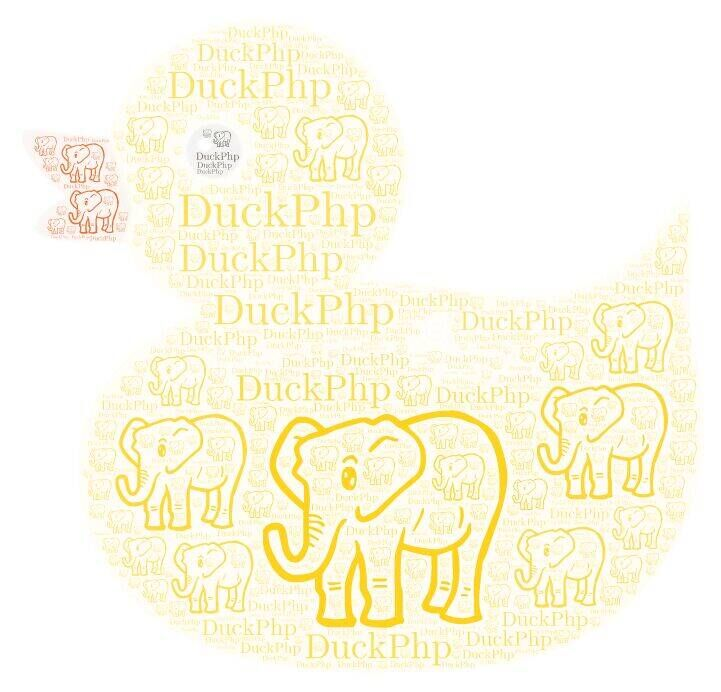

# DuckPhp

- 版本：v1.3.4 / 为 v1.3.5 准备
- 作者 QQ：85811616
- 官方 QQ 群：714610448

Gitee 仓库地址：https://gitee.com/dvaknheo/duckphp
Github 仓库地址：https://github.com/dvaknheo/duckphp

## 一、DuckPhp 是什么

DuckPhp 是一个零依赖、全组件可替换、部署与协作都很灵活的库模式 PHP 框架。

DuckPhp 的名字来源：

> 鸭子类型（Duck Typing）：如果它看起来像鸭子、游起来像鸭子、叫起来像鸭子，那它就是鸭子。

## 二、特点

### Composer 安装

```
composer require dvaknheo/duckphp # 用 require
./vendor/bin/duckphp new
```

第一句命令说明 duckphp 是库模式的框架，而不是由一堆库拼装起来的。

**DuckPhp 以库方式引入**，所以工程骨架不像其他框架那样包含一大堆不可删除的文件。

**DuckPhp 零依赖**。你不必担心第三方依赖改动带来的麻烦；不需要引入 101 个第三方包就能工作，稳定性完全可控。

`./vendor/bin/duckphp new` 命令会复制骨架文件，并根据你在 `composer.json` 中设置的 `src` 命名空间替换工程命名空间。

**DuckPhp 不限制你的工程的命名空间**

你也可以不用骨架文件，自己写代码。

### 样例一

#### 创建样例

我们通过一个简单样例快速理解 Duckphp

在工程目录下面写个文件 `sample1.php`

```php
<?php
require_once __DIR__ . '/vendor/autoload.php';

use DuckPhp\DuckPhpAllInOne as DuckPhpAllInOne;
use DuckPhp\DuckPhpAllInOne as Helper;
use MyHello as MyBusiness;
use MyHello as MyModel;

class MyHello extends DuckPhpAllInOne
{
    public function action_index()
    {
        $words = MyBusiness::_()->getTime();
        $url = __url('');
        $data = [
            'words' => $words,
            'url' => $url,
        ];
        Helper::Show($data,'main');
    }

    public function view_main($data)
    {
        echo <<<EOT
        You are visit: {$data['url']}<br>
        {$data['words']}
EOT;
        
    }
    public function getTime()
    {
        return "Hello,now is <".MyModel::_()->getData().'>';
    }
    public function getData()
    {
        return DATE(DATE_ATOM);
    }
}
$options = [
    'path' => __DIR__ ,
    // ...
];
MyHello::RunQuickly($options);
```

使用 go.php 作为服务器

```
php go.php run --host 127.0.0.1 --port 9628 --path-document .
```
本质上是调用 php 的内置服务器， 你也可以直接用 php 的内置服务器
```
php -S 127.0.0.1:9628 -t .
```

访问 http://127.0.0.1:9628/sample1.php 你就能看到  `TODO`

#### 说明

这里入口用的是 `DuckPhp\DuckPhpAllInOne` 类。同时可以看到 `use DuckPhp\DuckPhpAllInOne as Helper;`
流程是： `RunQuickly()` → `action_index()` → `Show()` → `view_main()`。

+   `MyHello::RunQuickly()` 扮演应用入口 角色， 演示可以有很多选项
+   `MyHello::action_index()` 扮演 控制器 角色 调用
+  调用助手类的 `Helper::Show()`  调用 view 层的 `view_main()`。
+  ...

#### DuckPhp 的部分特点

由这个例子，我们引申出 DuckPhp 的特点：

**DuckPhp 支持web模式 也支持命令行**
*不建议使用 PHP 内置命令行 Web 服务器；推荐把 nginx 或 Apache 的 `document_root` 指向 `public` 目录，按常规方式部署。*

**DuckPhp 不限制你的目录  支持全站路由、局部路径路由和无 PATH_INFO 路由**

> 现在许多 PHP 框架一个域名只能放一个应用。DuckPhp 回归 PHP 快速开发的本源。
> DuckPhp 不需要修改服务器配置也能使用，也支持放在子目录里。`DuckPhpAllInOne` 类相比 `DuckPhp` 类默认启用了无 PATH_INFO 路由。

DuckPhp 通过 composer 包 `dvaknheo/workermanhttpd` 扩展支持 Workerman，不需要修改工程代码即可运行，未来还会支持更多平台。

**DuckPhp 不限制你的工程的命名空间**

> 示例代码使用 `MyHello` 作为命名空间。

**DuckPhp 不需要一大堆配置文件**

> 它的配置大多使用默认值，通过调整选项可以得到不同行为。
> 这里的 `$options` 就是应用选项，你可以打开调试模式。有很多应用选项可用。具体请查看文档。

**DuckPhp 不需要手动写路由**

自动路由可以满足需求，如果不满足需求，你也可以自己写路由

**DuckPhp 无侵入，防止全局函数冲突引发的问题**

> 只有少数几个 `__` 开头的全局函数，你也可以覆盖它们。

### 样例二：嵌入工程

**DuckPhp 可以把其他 DuckPhp 工程当成插件嵌入当前工程**
这是 DuckPhp 的重要特色

你不需要在现有 DuckPhp 应用上做二次开发，直接把它当作插件使用即可。
写

```php
<?php
require_once __DIR__ . '/../vendor/autoload.php';

use DuckPhp\DuckPhpAllInOne;

class MyApi2 extends DuckPhpAllInOne
{
    public function action_index()
    {
        echo "I'm child.";
    }
}

class MyApi extends DuckPhpAllInOne
{
    public $options = [
        'app' => [
            MyApi2::class => [
                'controller_url_prefix' => 'child/',
            ],
        ]
    ];

    public function action_index()
    {
        $url_child = __url('child/index');
        echo "I'm Parent. Goto <a href='{$url_child}'>child</a>";
    }
}
$options = [
    'path' => __DIR__ ,
    // ...
];
MyApi::RunQuickly($options);

```
访问  '/' 可以看到 可跳转到 '/child/index'

在这里，`MyApi2` 和 `MyApi` 都是独立的 DuckPhp 应用，`MyApi` 把 `MyApi2` 作为子应用。

如果你不想为某个 API 写用户系统，可以把 composer 包的 `dvaknheo/duckadmin`的用户系统嵌入进来，然后用 `Helper::UserId()` 获取用户 ID，用 `Helper::AdminId()` 获取管理员 ID。


*子应用涉及静态资源、应用间通信、组件共享等复杂问题。*

### 样例三：组件替换

//TODO 代码

这个样例没有前面那么直观，但体现了 DuckPhp 的灵活性。

**DuckPhp 作为现代 PHP 库，全组件可替换是基本要求。** 如果对默认实现不满意，可以很容易地换成其他实现（即使需要第三方依赖）。DuckPhp 用可变单例方式保持调用接口不变，实现却可以替换；这样不需要魔改框架就能修复问题或切换组件。

DuckPhp 的应用调试非常方便，堆栈清晰。调用 `debug_print_backtrace(2)` 很容易发现问题。那些使用大量中间件的框架堆栈通常不够清晰。

> 调试用 `__trace_dump()`。

## 三、常规工程

当你用 `./vendor/bin/duckphp new` 创建工程后，会得到如下骨架文件。更详细的说明请见 `RULES.md`。

```
project/
├── composer.json
├── config/
│   └── DuckPhpSettings.config.php  # 全局设置
├── public/
│   └── index.php                   # Web 入口
├── src/
│   ├── Controller/                 # 控制器层：HTTP/CLI 请求入口
│   │   ├── Base.php
│   │   ├── ConsoleCommand.php      # CLI 子命令示例（默认未启用）
│   │   ├── ExceptionReporter.php   # 异常报告器（默认未启用）
│   │   ├── Helper.php
│   │   ├── MainController.php
│   │   ├── Session.php             # Session 管理
│   │   ├── SomeAction.php          # Action 示例
│   │   └── testController.php      # 测试控制器
│   ├── Business/                   # 业务层：业务逻辑
│   │   ├── Base.php
│   │   ├── DemoBusiness.php        # Business 示例
│   │   ├── Helper.php
│   │   └── SomeService.php         # Service 示例
│   ├── Model/                      # 模型层：数据访问
│   │   ├── Base.php
│   │   └── DemoModel.php           # Model 示例
│   └── System/                     # 系统层：应用配置与异常
│       ├── App.php                 # 应用核心配置
│       ├── BusinessException.php   # Business 异常（默认未启用）
│       ├── ControllerException.php # Controller 异常（默认未启用）
│       └── ProjectException.php    # 项目异常基类（默认未启用）
├── view/                           # 视图目录
│   ├── _sys/                       # 系统视图
│   │   ├── error_404.php
│   │   └── error_500.php
│   └── main.php                    # 默认视图示例
├── runtime/                        # 运行时目录（日志等）
├── cli.php                         # CLI 入口
├── RULES.md                        # 规则说明文件
└── vendor/
```

> **注意**：
> - `SomeAction.php`、`testController.php`、`DemoBusiness.php`、`SomeService.php`、`DemoModel.php` 是示例文件，实际项目中应删除并根据业务需求编写类似的类。
> - `ConsoleCommand.php`、`ExceptionReporter.php`、`BusinessException.php`、`ControllerException.php`、`ProjectException.php` 默认未启用。你可以：
>   - 精简工程：直接删除这些不用的文件。
>   - 启用功能：在 `src/System/App.php` 中取消对应的选项注释（`cli_command_classes`、`exception_reporter`、`exception_for_project` / `exception_for_business` / `exception_for_controller`）。
>
> `runtime/` 目录需要可写权限。

**DuckPhp 工程层级分明，不交叉引用。**

System → Controller → Business → Model

DuckPhp 的使用者角色分为 `业务工程师` 和 `核心工程师`。

- `业务工程师` 只需要研究业务代码。
- `核心工程师` 负责研究系统核心代码。

> 看完助手类教程后，`业务工程师` 就可以开始写业务代码了。不懂的地方可以问 `核心工程师`。

### 简单教程

// 写一个增删改查

## 四、其他特性

DuckPhp 支持 Composer，无 Composer 环境也可运行。DuckPhp 是 Composer 库，不需要单独的脚手架工程。

> 拥有自己 loader 但工程上意义不大。

`DuckPhp\Core\App` 是 `DuckPhp` 的子框架。某些情况下，你也可以直接使用 `DuckPhp\Core\App`。

DuckPhp 的 Controller 切换容易，独立，和其他类无关，简单明了。

DuckPhp 的路由也可以单独抽出使用。

> 实际工程中这三项单独拆出来使用的情况较少。

DuckPhp 支持扩展。这些扩展可独立，不一定只能用于 DuckPhp。

> 只要类支持 `init([], $context)` 都可以作为扩展。

DuckPhp 可以做到你的应用和 DuckPhp 系统代码只有一行关联。你的业务代码基本和 DuckPhp 系统代码无关。你只需要研究业务代码，不需要研究框架代码。

> 通过修改选项实现。

DuckPhp 有扩展能禁止你在 Controller 里直接写 SQL。有些框架为了防止开发者犯错而牺牲性能，但 DuckPhp 这种方式几乎不影响性能。

> 只是目前作用不大。

DuckPhp 耦合松散，扩展灵活方便，魔改容易。

> DuckPhp 的数据库类很简洁，你可以轻易方便地替换。

DuckPhp 的类尽量无状态。

DuckPhp 各组件没有直接引用，所以 `var_dump(AnyComponent::_())` 能看出来。

### 开发理念

DuckPhp 代码简洁，不做多余事情。最新版本默认 demo 运行根据 CodeCoverage 覆盖统计，只需要行数 376 / 4381（v1.2.13-dev）执行行数/总可执行行数。

DuckPhp 框架的设计原则：这个东西必须框架自带吗？不自带可以吗？

DuckPhp 每次发布都通过全代码覆盖的测试，因此具有很强的健壮性。

DuckPhp 没有 ORM，也不屏蔽 SQL，根据日志查 SQL 方便多了。它自己简单封装了 PDO。你也可以使用自己的 DB 类，或用第三方 ORM（教程里有使用 ThinkPHP-DB 的例子。[链接](docs/tutorial-db.db)）。

DuckPhp 不带模板引擎，PHP 本身就是模板引擎。

DuckPhp 不写 Widget，因为这和 MVC 分离原则相违背。

## 五、DuckPhp 的版本历程

起初，这是想搞个简单的 PHP Web 框架。现在使用方式简单，但内部设计并不简单。

+ 1.0.* 系列版本是前身 DNMVCS 单文件模式的版本
+ 1.1.* 系列版本是前身 DNMVCS 拆分成多文件的版本
+ 1.2.* 系列版本是改名 DuckPhp 后的版本，随着思想的变化，或许会有大的变更
+ 1.3.* 系列版本是计划开始有人大规模使用后的稳定版本，将会对历史负责

1.3 版本最大的变化是增加了相位概念，使得各应用之间相互插入也无影响。

1.3.4 增加了 Docker 支持，修复了多语言支持，为 1.3.5 准备。

## 六、DuckPhp 还要做什么


