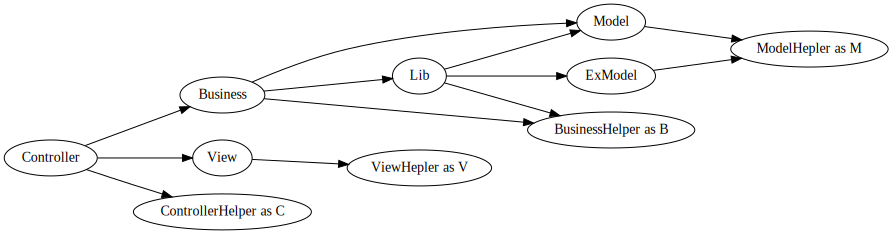
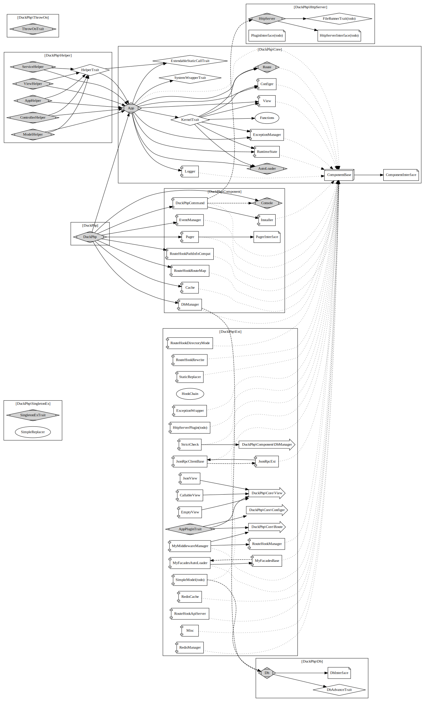

# DuckPhp
***v1.3.1 版本改进
作者QQ: 85811616
官方QQ群: 714610448

Gitee 仓库地址：https://gitee.com/dvaknheo/duckphp
Github 仓库地址：https://github.com/dvaknheo/duckphp

## 一、DuckPhp 是什么

DuckPhp 是一个零依赖、全组件可替换、部署与协作都极其灵活的库模式的 PHP 框架。

DuckPhp is a library-style PHP framework that offers zero dependencies, fully replaceable components, and exceptional flexibility in deployment and teamwork.

DuckPhp 的名字来源：

`Duck Typing` If it walks like a duck, swims like a duck, and quacks like a duck, then it probably is a duck. 

`鸭子类型`，这东西看起来像鸭子，叫起来像鸭子，所以就是鸭子。


##  二、优点详细说明

DuckPhp 是一个零依赖、全组件可替换、部署与协作都极其灵活的库模式的 PHP 框架。


### Composer 安装

```
composer require dvaknheo/duckphp # 用 require 

```
由此可以看出 duckphp 是库模式的框架，而不是一堆库创建起来的

DuckPhp 以库方式引入，所以 DuckPhp 工程骨架不像其他框架那样一大堆不可删除的文件

DuckPhp 零依赖，你不必担心第三方依赖改动而大费周折。**不需要引入101 个第三方包，就能工作**，稳定性完全可控。


### 样例一

最简单的例子。你只是想做个不要验证的 api。那你就写个api.php 文件

```php
<?php
require_once __DIR__ . '/../vendor/autoload.php';

use DuckPhp\DuckPhpAllInOne;

class MyApi extends DuckPhpAllInOne
{
	public function action_index()
	{
		$url_api = __url('api');
		$ret = "Hello. Goto api:<a href=$url_api>api</a>";
	}
	public function action_api()
	{
		return static::ShowJson(['date'=>DATE(DATE_ATOM)]);
	}
}
MyApi::RunQuickly([/*'is_debug'=>true*/]);

```

说明， 这里入口用的是 DuckPhpAllInOne 类，把东西封装成一个类的模式 DuckPhp\DuckPhp

这也可以看出例子特点

DuckPhp 不限制你的工程的命名空间固定为 `app` 。

DuckPhp 的配置基本都是使用默认方式。 不需要一大堆的配置文件。

DuckPhp 无侵入，杜绝全局函数冲突引发的问题

DuckPhp 支持全站路由，还支持局部路径路由和无 PATH_INFO 路由，不需要配服务器也能用。 可以在不修改 Web 服务器设置（如设置 PATH_INFO）的情况下使用，也可以在子目录里使用。

// 通过修改选项

DuckPhp 也支持在web 服务器的子目录里使用，同时也支持无 PATH_INFO 配置的 web 服务器。


DuckPhp 通过 WorkermanHttpd 扩展，支持 workerman 。不需要改工程代码，将来也支持 更多其他平台。


DuckPhp 可以做到你的应用和 DuckPhp 的系统代码只有一行关联。 这个是其他 PHP 框架目前都做不到的。你的业务代码，基本和 DuckPhp 的系统代码无关。你只要研究业务代码，不要研究框架代码。


### 样例二 插入其他工程

DuckPhp 可以把你的工程直接插入其他工程，不用修改。 你不需要在 DuckPhp 工程上做二次开发。

DuckPhp 很容易嵌入其他 PHP 框架。根据 DuckPhp 的返回值判断是否继续后面其他框架。

```php
<?php
require_once __DIR__ . '/../vendor/autoload.php';

use DuckPhp\DuckPhpAllInOne;

class MyApi2 extends DuckPhpAllInOne
{
	public function action_index()
	{
		echo "I'm child.";
	}
}
class MyApi extends DuckPhpAllInOne
{
	public $options = [
		'app'=>[
			MyApi2::class=>[
                'controller_url_prefix' => 'child/',
			],
		]
	];
	public function action_index()
	{
		$url_child = __url('child/index');
		echo "I'm Parent. Goto <a href='{$url_child}'>child</a>";
	}
}

MyApi::RunQuickly();
```
在这里  MyApi2 MyApi 都是独立的 DuckPhp 应用。 MyApi 把 MyApi2 作为子应用

当你懒得为你的api 写用户系统，你可以把 DuckAdmin 工程的用户系统就这么插入，然后用 Helper::UserId() 获得用户ID。


### 样例三 正常的工程文件模式

//TODO，嵌入指南里 文件结构那一章节


DuckPhp 的使用者角色分为 `业务工程师`和`核心工程师`。

`业务工程师` 只需要要研究业务代码。

`核心工程师` 才需要研究做系统核心代码。


## 四、DuckPhp 的优点

#### 1. 可扩展


#### 2.  全组件可替换


无依赖

作为一个现代的 PHP 库， 全组件可替换是必须的。

DuckPhp 用可变单例方式，解决了**系统的调用形式不变，实现形式可变**，不需要魔改来修复系统漏洞。而其他框架用的 IoC,DI 技术则复杂且不方便调试。

// 如果对默认实现不满，你也可以很容易改用需要第三方依赖的实现。


#### 4.  超低耦合

DuckPhp 耦合松散，扩展灵活方便，魔改容易。

比如 DuckPhp 的数据库类很简洁，而且，你可以轻易方便的替换。

#### 5. 简洁

#### 6. 灵活自由

#### 9. 区分使用角色

#### 8. 全覆盖单元测试

#### 10. 其他优点


其他还有更多说到的优点，用到的时候会觉得精妙。


 // 不建议使用命令行的 web 服务器， 你把 nginx 或 apache 的 document_root 设置为  public 目录按常规框架调整即可。


DuckPhp 有扩展能做到禁止你在 Controller 里直接写 sql 。有时候，框架必须为了防止人犯蠢，而牺牲了性能。但 DuckPhp 这么做几乎不影响性能。
// 只是现在没多大作用


DuckPhp 因为作者强迫症，每次发布都是通过全代码覆盖的测试，因此有很大健壮性。

DuckPhp 的类尽量无状态。

DuckPhp 各组件是无直接引用的，所以 var_dump() 能看出来。

DuckPhp 代码简洁，不做多余事情。最新版本默认 demo 运行根据 CodeCoverage 覆盖统计， 只需要行数 376 / 4381 (v1.2.13-dev)  执行行数/总可执行行数  。

DuckPhp 的应用调试非常方便，堆栈清晰，调用 debug_print_backtrace(2) 很容易发现。那些用了中间件的框架的堆栈很不清晰。

DuckPhp 工程层级分明，不交叉引用。


// 开发组理念 

DuckPhp 框架的设计原则：这东西非得框架自带么，不自带行么。


DuckPhp 支持 composer。无 composer 环境也可运行。DuckPhp 是 Composer 库，不需要单独的脚手架工程。
// 拥有自己 loader 但工程意义不大。

DuckPhp/Core/App 是 DuckPhp 的子框架。有时候你用 DuckPhp/Core/App 也行。

DuckPhp 的 Controller 切换容易，独立，和其他类无关，简单明了。

DuckPhp 的路由也可以单独抽出使用。

// 实际工程上这三项没多大意义

DuckPhp 支持扩展。这些扩展可独立，不一定非要仅仅用于 DuckPhp 。

//工程上意义不大

## 五、DuckPhp 不做什么

* ORM ，和各种屏蔽 sql 的行为，根据日志查 sql 方便多了。 自己简单封装了 pdo 。你也可以使用自己的DB类。 你也可以用第三方ORM（教程就有使用 thinkphp-db 的例子。[链接](docs/tutorial-db.db)）
* 模板引擎，PHP本身就是模板引擎。
* Widget ， 和 MVC 分离违背。

## 六、理解 DuckPhp 的原则

DuckPhp 工程层级关系图

```text
           /-> View
Controller --> Business ---------------> Model
         \         \   \            /         \
          \         \   \--> Service --------> ModelEx --> ModelHelper
           \         \              \                
            \         ---------------->(Business)Helper
             \-->(Controller)Helper
```


* Controller 按 URL 入口走 调用 View 和 Business
* Business 按业务走 ,调用 model 和其他第三方代码。
* Model 按数据库表走，基本上只实现和当前表相关的操作。
* View 按页面走
* 不建议 Model 抛异常

1. 如果  Business 业务之间 相互调用怎么办?
添加后缀为 Service 用于 Business 共享调用，不对外，如 CacheService.

2. 如果跨表怎么办?，三种解决方案
    1. 在主表里附加，其他表估计用不到的情况。
    2. 添加后缀为 ModelEx 用于表示这个 ModelEx 是多个表的，如 UserModelEx。
    3. 或者单独和数据库不一致如取名 UserAndPlayerRelationModel

## 七、常用工程目录结构

DuckPhp 代码里的 template 目录就是我们的工程目录示例。也是工程桩代码。

在执行 `./vendor/bin/duckphp new` 的时候，会把代码复制到工程目录。 并做一些改动。

@script 目录结构

```text

```
这个模板目录，是大型工程的目录结构，对于小项目来说，可还可以继续精简
这个目录结构里，`业务工程师`只能写 `src/Controller`,`src/Model`,`src/Business`,`view` 这四个目录。
其他则是 `核心工程师` 的活。

src 目录，就是放 `ProjectTemplate` 命名空间的东西了。 

命名空间 `ProjectTemplate`  是 可调的。比如调整成 MyProject ,TheBigOneProject  等。
可以用 `./vendor/bin/duckphp new --namespace TheBigOneProject` 调整。

文件都不复杂。基本都是空类或空继承类，便于不同处理。
这些结构能精简么？
可以，你可以一个目录都不要。

System/App.php 这个文件的入口类继承 DuckPhp\DuckPhp 类，工程的入口流程会在这里进行，这里是`核心工程师`重点了解的类。

各个目录的 Base 是你自己要改的基类，基本只实现了单例模式。

### 如何精简目录
* 移除 config/ 目录,
* 移除 view/\_sys/ 目录 你需要设置启动选项里404和500错误 'error\_404','error\_500 。
* 移除 view 目录如果你不需要 view ，如 API 项目。
* 移除 duckphp-project 如果你不需要额外的命令行。
* 移除 测试和示例文件

@script 目录结构

##  八、教程索引

助手类教程在这里 [助手类教程](docs/tutorial-helper.md)，基本上，看完助手类教程，`业务工程师`就可以开干了。

此外有什么不了解的，问`核心工程师`吧。


快速教程完成后，或许你还需要看看 [通用教程](docs/tutorial-general.md)
比如路由方面，常见是文件路由。 [路由教程](docs/tutorial-route.md)

如果你的项目使用内置数据库，或许你还要看  [数据库教程](docs/tutorial-db.md)

还有 [异常处理](docs/tutorial-exception.md) 异常处理，和 [事件处理](docs/tutorial-event.md)

命令行怎么处理，需要看  [命令行教程](docs/tutorial-console.md)

一些额外功能，你要看   [内置扩展介绍](docs/tutorial-extension.md)

最后，查看 [开发相关](docs/tutorial-support.md) 加入开发


DuckPhp 工程有上百个选项调整得到不同的结果。具体参考 [选项参考](docs/ref/options.md)

### 2. 复杂样例

工程附带的模板文件 `template/public/demo.php` 在单一的文件里演示如何使用 `DuckPhp`。

需要注意的是，这个样例是为了演示特性把所有东西集中到一个文件，实际编码不会把所有东西全放在同一个文件里。

## 十一、架构

### 系统架构图



### DuckPhp 类/文件结构参考

 (粗体部分是启动的时候引用的文件)


## 十二、DuckPhp 还要做什么

**我真的很需要反馈啊，给我个反馈吧**

* 文档，文档目前已经有很多了。但是还存在缺失，需要人帮我过一下。
* 范例，例子还太少太简单了。
* 更多的杀手级应用。

## 十三、还有什么要说的

使用它，鼓励我，让我有写下去的动力

## DuckPhp 的版本历程

+ 1.0.\* 系列版本是前身 DNMVCS 单文件模式的版本
+ 1.1.\* 系列版本是前身 DNMVCS 拆分成多文件的版本
+ 1.2.\* 系列版本是改名 DuckPhp 后的版本，随着思想的变化，或许会有大的变更
+ 1.3.\* 系列版本将是计划开始有人大规模使用后的稳定版本，将会对历史负责了。
起初，这是是想搞个简单的 PHP Web 简单框架 。现在是使用方式简单，实际方式不简单。

1.3 版本，最大的变化是增加了相位概念，使得各应用之间相互插入也无影响
1.3.4 ，增加了docker 支持，修复了多语言支持, 为 1.3.5 准备


需要的例子

1 所有整合到一起的
2 api 文件， 放其他底下也生效的
3 a 引入 b 的

