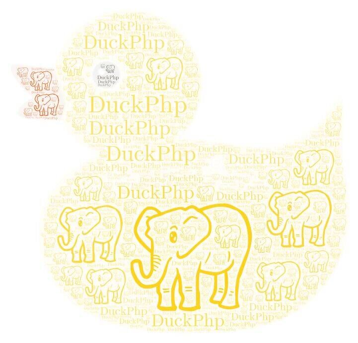

# DuckPhp
[English](README.md) | [中文](README-zh-CN.md)
[toc]

***v1.2.12版***
1.2.12 版本增加了新的开发范式。待文档

作者QQ: 85811616

官方QQ群: 714610448

Gitee 仓库地址：https://gitee.com/dvaknheo/duckphp

Github 仓库地址：https://github.com/dvaknheo/duckphp

##  一、教程
[**快速入门**](docs/tutorial-quickstart.md) ,快速入门页面。

[**文档索引页**](docs/index.md) ,所有文档索引页面，所有文档的集合入口

### 直接运行演示
```
cd template
php ./duckphp-project run
```
### Composer 安装

```
composer require dvaknheo/duckphp # 用 require 
./vendor/bin/duckphp new --help   # 查看有什么指令
./vendor/bin/duckphp new    # 创建工程
./vendor/bin/duckphp run    # --host=127.0.0.1 --port=9527 # 开始 web 服务器
```
不建议使用命令行的 web 服务器， 你把 nginx 或 apache 的 document_root 设置为  public 目录按常规框架调整即可。

DuckPhp 也支持在子目录里使用，同时也支持无 path_info 配置的 web 服务器。

## 二、DuckPhp 是什么

DuckPhp 的名字来源：

`Duck Typing` If it walks like a duck, swims like a duck, and quacks like a duck, then it probably is a duck. 

`鸭子类型`，这东西看起来像鸭子，叫起来像鸭子，所以就是鸭子。

起初，这是是想搞个简单的 PHP Web 简单框架 。现在是使用方式简单，实际方式不简单。

DuckPhp 的版本历程

+ 1.0.\* 系列版本是前身 DNMVCS 单文件模式的版本
+ 1.1.\* 系列版本是前身 DNMVCS 拆分成多文件的版本
+ 1.2.\* 系列版本是改名 DuckPhp 后的版本，随着思想的变化，或许会有大的变更
+ 1.3.\* 系列版本将是计划开始有人大规模使用后的稳定版本，将会对历史负责了。

## 三、DuckPhp 的理念
**业务层**。通常的 Model，Controller，View 少了一层。而因为这种缺层，导致了很多很糟糕的场景。你会发现很多人在 Contorller 里写一堆代码，或者在 Model 里写一堆代码。

这个层。有人称呼 Service ,有人称呼 Logic 。我最初的时候称呼为 App ，很长时间内我都称为 Service 。现在，我称呼为 Business 业务层。之所以改过来， Business 就是业务的意思啊。不用多想。 而且现在 Service 服务 这个层被用滥了。现在第三方的平台过来的东西才叫 Service ，业务范围之内的，就叫 Business 吧。Service 给人的感觉是业务需要的服务，不能完成一个功能。

所以，Business 按业务走，Model 层按数据库走，Controller 层按 URL 地址走，View 按页面走，这就是 DuckPhp 的理念。

DuckPhp 的最大意义是思想，只要思想在，什么框架你都可以用。
你可以不用 DuckPhp 实现 Controller-Business-Model 架构。
只要有这个思想就是理念成功了。

## 四、DuckPhp 的优点

#### 1. 可扩展

DuckPhp 可以把你的工程直接插入其他工程，不用修改。 你不需要在 DuckPhp 工程上做二次开发。

DuckPhp 不限制你的工程的命名空间固定为 `app` 。

DuckPhp 很容易嵌入其他 PHP 框架。根据 DuckPhp 的返回值判断是否继续后面其他框架。

DuckPhp 支持扩展。这些扩展可独立，不一定非要仅仅用于 DuckPhp 。

#### 2.  全组件可替换

作为一个现代的 PHP 库， 全组件可替换是必须的。

DuckPhp 用可变单例方式，解决了**系统的调用形式不变，实现形式可变**，不需要魔改来修复系统漏洞。而其他框架用的 IoC,DI 技术则复杂且不方便调试。

#### 3.  高可靠性，无依赖

DuckPhp 无第三方依赖，你不必担心第三方依赖改动而大费周折。**不需要引入101 个第三方包，就能工作**，稳定性完全可控。

如果对默认实现不满，你也可以很容易改用需要第三方依赖的实现。

比如 DuckPhp 的数据库类很简洁，而且，你可以轻易方便的替换。

#### 4.  超低耦合

DuckPhp 耦合松散，扩展灵活方便，魔改容易。

DuckPhp 可以做到你的应用和 DuckPhp 的系统代码只有一行关联。 这个是其他 PHP 框架目前都做不到的。你的业务代码，基本和 DuckPhp 的系统代码无关。你只要研究业务代码，不要研究框架代码。

DuckPhp 的 Controller 切换容易，独立，和其他类无关，简单明了。

DuckPhp 的路由也可以单独抽出使用。

#### 5. 简洁

DuckPhp 以库方式引入，所以 DuckPhp 工程骨架不像其他框架那样一大堆不可删除的文件

DuckPhp 框架的设计原则：这东西非得框架自带么，不自带行么。

DuckPhp 的配置基本都是使用默认方式。 不需要一大堆的配置文件。

DuckPhp 代码简洁，不做多余事情。最新版本默认 demo 运行根据 CodeCoverage 覆盖统计， 只需要行数 376 / 4381 (v1.2.13-dev)  执行行数/总可执行行数  。

DuckPhp 的应用调试非常方便，堆栈清晰，调用 debug_print_backtrace(2) 很容易发现。那些用了中间件的框架的堆栈很不清晰。

DuckPhp 各组件是无直接引用的，所以 var_dump() 能看出来。

DuckPhp/Core/App 是 DuckPhp 的子框架。有时候你用 DuckPhp/Core/App 也行。类似 lumen 之于 Laravel 。

#### 6. 灵活自由

DuckPhp 支持全站路由，还支持局部路径路由和无 PATH_INFO 路由，不需要配服务器也能用。 可以在不修改 Web 服务器设置（如设置 PATH_INFO）的情况下使用，也可以在子目录里使用。

DuckPhp 支持 composer。无 composer 环境也可运行。DuckPhp 是 Composer 库，不需要单独的脚手架工程。

#### 7. 最小惊讶原则(Principle of least astonishment)

DuckPhp 遵守最小惊讶原则，尽量避免一下常见问题：

“这东西从哪里来的，怎么就出现。这东西能干什么，我删除不行么。”

避免了注解之类不知道从哪里冒出来的东西。

#### 8. 全覆盖单元测试

DuckPhp 因为作者强迫症，每次发布都是通过全代码覆盖的测试，因此有很大健壮性。

#### 9. 区分使用角色

DuckPhp 的使用者角色分为 `业务工程师`和`核心工程师`。

`业务工程师` 只需要要研究业务代码。

`核心工程师` 才需要研究做系统核心代码。

#### 10. 其他优点

DuckPhp 无侵入，杜绝全局函数冲突引发的问题

DuckPhp 工程层级分明，不交叉引用。

DuckPhp 的类尽量无状态。

其他还有更多说到的优点，用到的时候会觉得精妙。

DuckPhp 有扩展能做到禁止你在 Controller 里直接写 sql 。有时候，框架必须为了防止人犯蠢，而牺牲了性能。但 DuckPhp 这么做几乎不影响性能。

DuckPhp 通过 WorkermanHttpd 扩展，支持 workerman 。不需要改工程代码，将来也支持 更多其他平台。

## 五、DuckPhp 不做什么

* ORM ，和各种屏蔽 sql 的行为，根据日志查 sql 方便多了。 自己简单封装了 pdo 。你也可以使用自己的DB类。 你也可以用第三方ORM（教程就有使用 thinkphp-db 的例子。[链接](docs/tutorial-db.db)）
* 模板引擎，PHP本身就是模板引擎。
* Widget ， 和 MVC 分离违背。

## 六、理解 DuckPhp 的原则

DuckPhp 工程层级关系图

```text
           /-> View
Controller --> Business ---------------> Model
         \         \   \            /         \
          \         \   \--> Service --------> ModelEx --> ModelHelper
           \         \              \                
            \         ---------------->(Business)Helper
             \-->(Controller)Helper
```


* Controller 按 URL 入口走 调用 View 和 Business
* Business 按业务走 ,调用 model 和其他第三方代码。
* Model 按数据库表走，基本上只实现和当前表相关的操作。
* View 按页面走
* 不建议 Model 抛异常

1. 如果  Business 业务之间 相互调用怎么办?
添加后缀为 Service 用于 Business 共享调用，不对外，如 CacheService.

2. 如果跨表怎么办?，三种解决方案
    1. 在主表里附加，其他表估计用不到的情况。
    2. 添加后缀为 ModelEx 用于表示这个 ModelEx 是多个表的，如 UserModelEx。
    3. 或者单独和数据库不一致如取名 UserAndPlayerRelationModel
## 七、常用工程目录结构

DuckPhp 代码里的 template 目录就是我们的工程目录示例。也是工程桩代码。

在执行 `./vendor/bin/duckphp new` 的时候，会把代码复制到工程目录。 并做一些改动。

@script 目录结构

```text
.
├── config
│   ├── DuckPhpApps.config.php
│   └── DuckPhpSettings.config.php
├── duckphp-project
├── public
│   └── index.php
├── runtime
│   └── keepme.txt
├── src
│   ├── Business
│   │   ├── Base.php
│   │   ├── BusinessException.php
│   │   ├── CommonService.php
│   │   ├── DemoBusiness.php
│   │   └── Helper.php
│   ├── Controller
│   │   ├── Base.php
│   │   ├── CommonAction.php
│   │   ├── ControllerException.php
│   │   ├── ExceptionReporter.php
│   │   ├── Helper.php
│   │   ├── MainController.php
│   │   ├── Session.php
│   │   ├── dbtestControllert.php
│   │   └── testController.php
│   ├── Model
│   │   ├── Base.php
│   │   ├── CrossModelEx.php
│   │   ├── DemoModel.php
│   │   └── Helper.php
│   └── System
│       ├── App.php
│       ├── Helper.php
│       ├── Options.php
│       └── ProjectException.php
└── view
    ├── _sys
    │   ├── error_404.php
    │   └── error_500.php
    ├── files.php
    ├── main.php
    └── test
        └── done.php

```
这个模板目录，是大型工程的目录结构，对于小项目来说，可还可以继续精简
这个目录结构里，`业务工程师`只能写 `src/Controller`,`src/Model`,`src/Business`,`view` 这四个目录。
其他则是 `核心工程师` 的活。

src 目录，就是放 `ProjectTemplate` 命名空间的东西了。 

命名空间 `ProjectTemplate`  是 可调的。比如调整成 MyProject ,TheBigOneProject  等。
可以用 `./vendor/bin/duckphp new --namespace TheBigOneProject` 调整。

文件都不复杂。基本都是空类或空继承类，便于不同处理。
这些结构能精简么？
可以，你可以一个目录都不要。

System/App.php 这个文件的入口类继承 DuckPhp\DuckPhp 类，工程的入口流程会在这里进行，这里是`核心工程师`重点了解的类。

各个目录的 Base 是你自己要改的基类，基本只实现了单例模式。


### 如何精简目录
* 移除 config/ 目录,
* 移除 view/\_sys/ 目录 你需要设置启动选项里404和500错误 'error\_404','error\_500 。
* 移除 view 目录如果你不需要 view ，如 API 项目。
* 移除 duckphp-project 如果你不需要额外的命令行。
* 移除 测试和示例文件

@script 目录结构

##  八、教程索引

助手类教程在这里 [助手类教程](docs/tutorial-helper.md)，基本上，看完助手类教程，`业务工程师`就可以开干了。

此外有什么不了解的，问`核心工程师`吧。


快速教程完成后，或许你还需要看看 [通用教程](docs/tutorial-general.md)
比如路由方面，常见是文件路由。 [路由教程](docs/tutorial-route.md)

如果你的项目使用内置数据库，或许你还要看  [数据库教程](docs/tutorial-db.md)

还有 [异常处理](docs/tutorial-exception.md) 异常处理，和 [事件处理](docs/tutorial-event.md)

命令行怎么处理，需要看  [命令行教程](docs/tutorial-console.md)

一些额外功能，你要看   [内置扩展介绍](docs/tutorial-extension.md)


最后，查看 [开发相关](docs/tutorial-support.md) 加入开发


## 九、样例
### 1. hello world

@script File: `template/public/helloworld.php`

```php
<?php declare(strict_types=1);
/**
 * DuckPhp
 * From this time, you never be alone~
 */
require_once(__DIR__.'/../../autoload.php');        // @DUCKPHP_HEADFILE

class MainController
{
    public function action_index()
    {
        echo "hello world";
    }
}
$options = [
    'namespace_controller' => "\\",   // 本例特殊，设置控制器的命名空间为根，而不是默认的 Controller
    // 还有百来个选项以上可用，详细请查看参考文档
];
\DuckPhp\Core\App::RunQuickly($options);

```
从这个样例，我们可以简单的知道调整 `$options` 选项可以得到不同的结果。

DuckPhp 工程有上百个选项调整得到不同的结果。具体参考 [选项参考](docs/ref/options.md)

### 2. 复杂样例

工程附带的模板文件 `template/public/demo.php` 在单一的文件里演示如何使用 `DuckPhp`。

需要注意的是，这个样例是为了演示特性把所有东西集中到一个文件，实际编码不会把所有东西全放在同一个文件里。


@script File: `template/public/demo.php`

```php
<?php declare(strict_types=1);
/**
 * DuckPHP
 * From this time, you never be alone~
 */

// 以下部分是核心工程师写。

namespace MySpace\System
{
    // 自动加载文件
    require_once(__DIR__.'/../../autoload.php');        // @DUCKPHP_HEADFILE
    
    use DuckPhp\Core\SingletonTrait;
    use DuckPhp\DuckPhp;
    use DuckPhp\Ext\CallableView;
    use MySpace\View\Views;

    class App extends DuckPhp
    {
        // @override 重写
        public $options = [
            'is_debug' => true,
                // 开启调试模式
            'path_info_compact_enable' => true,
                // 开启单一文件模式，服务器不配置也能运行
            'ext' => [
                CallableView::class => true,
                // 默认的 View 不支持函数调用，我们开启自带扩展 CallableView 代替系统的 View
            ],
            'callable_view_class' => Views::class,
                // 替换的 View 类。
        ];
        // @override 重写
        protected function onInit()
        {
            //初始化之后在这里运行。
            //var_dump($this->options);//查看总共多少选项
        }
    }
    //服务基类, 为了 Business::_() 可变单例。
    class BaseBusiness
    {
        use SingletonTrait;
    }
} // end namespace
// 助手类

//------------------------------
// 以下部分由应用工程师编写，不再和 DuckPhp 的类有任何关系。

namespace MySpace\Controller
{
    use MySpace\Business\MyBusiness;  // 引用助手类
    class Helper
    {
        use \DuckPhp\Helper\ControllerHelperTrait;
        // 添加你想要的助手函数
    }
    class MainController
    {
        public function __construct()
        {
            // 在构造函数设置页眉页脚。
            Helper::setViewHeadFoot('header', 'footer');
        }
        public function action_index()
        {
            //获取数据
            $output = "Hello, now time is " . __h(MyBusiness::_()->getTimeDesc()); // html编码
            $url_about = __url('about/me'); // url 编码
            Helper::Show(get_defined_vars(), 'main_view'); //显示数据
        }
    }
    class aboutController
    {
        public function action_me()
        {
            $url_main = __url(''); //默认URL
            Helper::setViewHeadFoot('header', 'footer');
            Helper::Show(get_defined_vars()); // 默认视图 about/me ，可省略
        }
    }
} // end namespace

namespace MySpace\Business
{
    use MySpace\Helper\BusinessHelper as B;
    use MySpace\Model\MyModel;
    use MySpace\System\BaseBusiness;
    class BusinessHelper
    {
        use  \DuckPhp\Helper\BusinessHelperTrait;
        // 添加你想要的助手函数
    }
    class MyBusiness extends BaseBusiness
    {
        public function getTimeDesc()
        {
            return "<" . MyModel::getTimeDesc() . ">";
        }
    }

} // end namespace

namespace MySpace\Model
{
    use MySpace\Helper\ModelHelper as M;
    class ModelHelper
    {
        use \DuckPhp\Helper\ModelHelperTrait;
        // 添加你想要的助手函数
    }
    class MyModel
    {
        public static function getTimeDesc()
        {
            return date(DATE_ATOM);
        }
    }
}
// 把 PHP 代码去掉看，这是可预览的 HTML 结构

namespace MySpace\View {
    class Views
    {
        public static function header($data)
        {
            extract($data); ?>
            <html>
                <head>
                </head>
                <body>
                <header style="border:1px gray solid;">I am Header</header>
    <?php
        }

        public static function main_view($data)
        {
            extract($data); ?>
            <h1><?=$output?></h1>
            <a href="<?=$url_about?>">go to "about/me"</a>
    <?php
        }
        public static function about_me($data)
        {
            extract($data); ?>
            <h1> OK, go back.</h1>
            <a href="<?=$url_main?>">back</a>
    <?php
        }
        public static function footer($data)
        {
            ?>
            <footer style="border:1px gray solid;">I am footer</footer>
        </body>
    </html>
    <?php
        }
    }
} // end namespace

//------------------------------
// 入口，放最后面避免自动加载问题

namespace
{
    $options = [
        // 'override_class' => 'MySpace\System\App',
        // 你也可以在这里调整选项。覆盖类内选项
    ];
    \MySpace\System\App::RunQuickly($options);
}

```
## 十、nginx 配置
这是我的 nginx 配置，如果在安装时候出现什么问题，欢迎反馈。
毕竟一般配置好后都不会去动。出现什么安装问题会没特别在意


```
server {
    root DUCKPHP_ROOT/template/public;
    index index.php index.html index.htm;
    
    try_files $uri $uri/ /index.php$request_uri;
    location ~ \.php {
        fastcgi_pass 127.0.0.1:9000;
        fastcgi_index index.php;
        fastcgi_split_path_info ^(.*\.php)(/.*)?$;
        fastcgi_param PATH_INFO $fastcgi_path_info;
        fastcgi_param SCRIPT_FILENAME $document_root$fastcgi_script_name;
        include fastcgi_params;
    }
}
```
## 十一、架构
### 系统架构图


### DuckPhp 类/文件结构参考

 (粗体部分是启动的时候引用的文件)


## 十二、DuckPhp 还要做什么

**我真的很需要反馈啊，给我个反馈吧**

* 文档，文档目前已经有很多了。但是还存在缺失，需要人帮我过一下。
* 范例，例子还太少太简单了。
* 更多的杀手级应用。

## 十三、还有什么要说的

使用它，鼓励我，让我有写下去的动力

