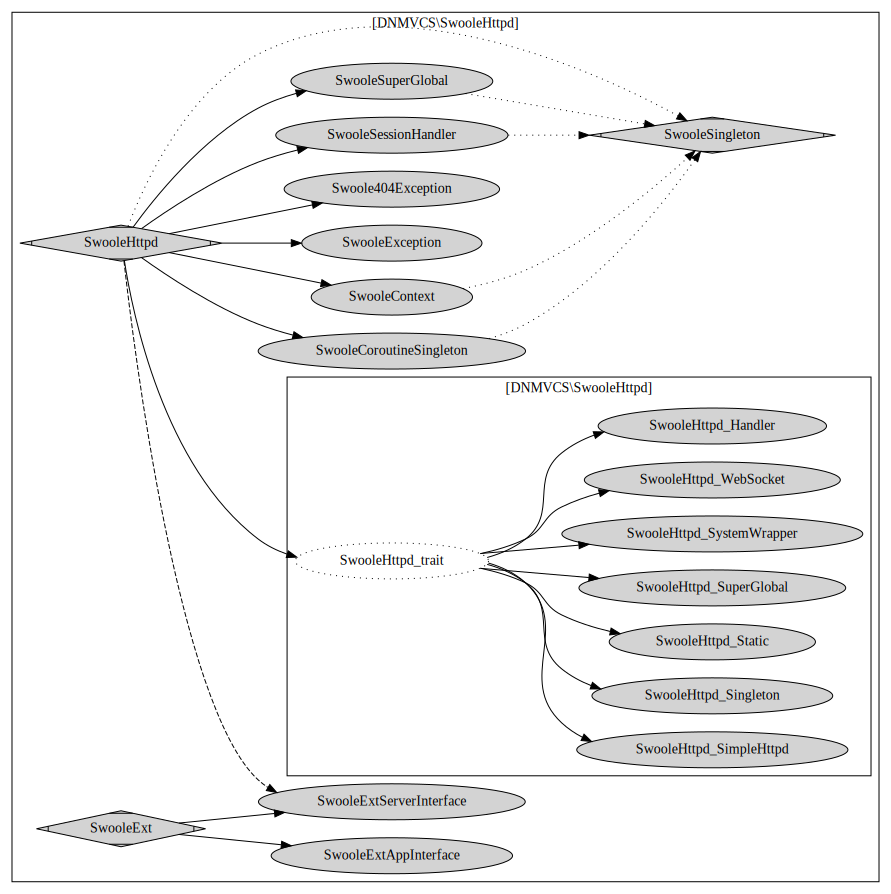

# 第一章 DN-MVCS 介绍
作者QQ: 85811616

官方QQ群: 714610448

[查看 SwooleHttpd 的文档](README-SwooleHttpd.md)
##  教程
[教程](tutorial.md) ,强烈推荐先过 [教程](tutorial.md) 这篇文章。

### Composer 安装

```
composer require dnmvcs/framework
./vendor/bin/dnmvcs --help
./vendor/bin/dnmvcs --create
```

## DN-MVCS 是什么

一个 PHP Web 简单框架 

使用原则：比通常的 Model，Controller，View 多了 Service 缺层。弥补了 常见 Web 框架缺少的业务逻辑层。
而因为这种缺层，导致了很多很糟糕的场景。你会发现很多人在 Contorller 里写一堆代码，或者在 Model 里写一堆代码。

使用 DN-MVCS，让网站开发者专注于业务逻辑。

## DN-MVCS 的优点
### 主要优点
1. DN-MVCS 可以做到你的应用和 DN-MVCS 的系统代码只有一行关联。 这个是其他 PHP 框架目前都做不到的。你的代码，基本和 DN-MVCS的系统代码无关。
2. DN-MVCS 用可变单例方式，解决了【系统的调用形式不变，实现形式可变】，比如不用 hack 来改系统漏洞。而其他框架用的 IoC,DI 技术则复杂且不方便调试。
3. DN-MVCS 做到了 swoole 和 fpm 代码无缝切换。单例变成协程单例。
4. DN-MVCS 的应用调试非常方便，堆栈清晰，调用 debug_print_backtrace(2) 很容易发现。那些用了中间件的框架的堆栈很不清晰。
5. DN-MVCS 无第三方依赖，你不必担心第三方依赖改动而大费周折。
6. DN-MVCS 支持 composer。无 composer 环境也可运。
7. DN-MVCS 耦合松散，扩展灵活方便，魔改容易。
8. DN-MVCS 是库，可以按 composer 库的方式引入
9. DN-MVCS 代码简洁，不做多余事情。

### DN-MVCS 还有以下优点：

* DN-MVCS 的 Controller 切换容易，独立，和其他类无关，简单明了。
* DN-MVCS 很容易嵌入其他 PHP 框架。根据 DN-MVCS 的返回值判断是否继续后面其他框架。
* DN-MVCS 支持全站路由，还支持局部路径路由和非 PATH_INFO 路由，不需要配服务器也能用。 可以在不修改 Web 服务器设置（如设置 PATH_INFO）的情况下使用，也可以在子目录里使用。
* DN-MVCS 的路由也可以单独抽出使用。
* DN-MVCS 支持扩展。这些扩展可独立，不一定非要仅仅用于 DN-MVCS。
* DN-MVCS 的数据库类很简洁，而且，你可以轻易方便的替换。如教程就有使用 thinkphp-db 的例子。
* DN-MVCS 有扩展能做到禁止你在 Controller 里直接写 sql 。有时候，框架必须为了防止人犯蠢，而牺牲了性能。但 DN-MVCS 这么做几乎不影响性能。
* DN-MVCS/Core 是 DN-MVCS 的子框架。有时候你用 DN-MVCS/Core 也行。类似 lumen 之于 Laravel
* DN-MVCS/Core 没有数据类，因为数据库类不是 Web 框架的必备。Laravel 的 ORM 确实很强大。但是意味着和 jquery 那样不可调试。
* DN-MVCS 可以规范为，Service 类只能用 MY\Base\ServiceHelper . Controller 类 只能用 MY\Base\ControllerHelper .Model 类只能引用 MY\Base\ModelHepler。 View 类只能用 ViewHelper ，其他类不允许用。也可以规范成 只用 MY\Base\App 类这个系统类。其中 MY 这个命名空间你可以自定义。

### 和其他框架简单对比

|功能                 | CodeIgnter 4 | ThinkPHP 6 | Laravel 6 | DN-MVCS |
|---------------------|--------------|------------|-----------|---------|
|仅一行关联           |              |            |           | V       |
|堆栈清晰             | V            | V          |           | V       |
|不改源码解决所有问题 |              |            |           | V       |
|swoole/fpm 无缝切换  |              |            |           | V       |
|以库引用             |              |            |           | V       |
|单一 composer 框架   |              |            |           | V       |
|无第三方依赖         |              |            |           | V       |
|高性能               | V            | V          |           | V       |
|代码简洁             | V            | V          |           | V       |

## 关于 Servivce 层

MVC 结构的时候，你们业务逻辑放在哪里？
新手放在 Controller ，后来的放到 Model ，后来觉得 Model 和数据库混一起太乱， 搞个 DAO 层吧。
可是 一般的 PHP 框架不提供这个功能。
所以，Service 按业务走，Model 层按数据库走，Controller 层按 URL 地址走，View 按页面走，这就是 DN-MVCS 的理念。

DN-MVCS 的最大意义是思想，只要思想在，什么框架你都可以用
你可以不用 DN-MVCS 实现 Controller-Service-Model 架构。
只要有这个思想就是理念成功了。

## 理解 DN-MVCS 的原则

DN-MVCS 层级关系图

```text
           /-> View-->ViewHelper
Controller --> Service ------------------------------ ---> Model
         \         \   \               \  /                  \
          \         \   \-> LibService ----> ExModel----------->ModelHelper
           \         \             \                
            \         ---------------->ServiceHelper
             \-->ControllerHelper
```


* Controller 按 URL 入口走 调用 view 和service
* Service 按业务走 ,调用 model 和其他第三方代码。
* Model 按数据库表走，基本上只实现和当前表相关的操作。
* View 按页面走
* 不建议 Model 抛异常
* ControllerHelper,ServiceHelper,ModelHelper,ViewHelper 都为助手类，通常缩写为 C, S, M, V

1. 如果 Service 相互调用怎么办?
添加后缀为 LibService 用于 Service 共享调用，不对外，如MyLibService
2. 如果跨表怎么办?，三种解决方案
    1. 在主表里附加，其他表估计用不到的情况。
    2. 添加后缀为 ExModel 用于表示这个 Model 是多个表的，如 UserExModel。
    3. 或者单独和数据库不一致如取名 UserAndPlayerRelationModel

## DN-MVCS 不做什么

* ORM ，和各种屏蔽 sql 的行为，根据日志查 sql 方便多了。 自己简单封装了 pdo 。你也可以使用自己的DB类。 你也可以用第三方ORM（教程最末有替换成 think-orm 的方法）
* 模板引擎，PHP本身就是模板引擎。
* Widget ， 和 MVC 分离违背。
* 接管替代默认的POST，GET，SESSION 。系统提供给你就用，不要折腾这些。 *除非为了支持 swoole*

## DN-MVCS 还要做什么

**我真的很需要反馈啊，给我个反馈吧**

* 文档，教程是有了，但还是不太够。
* 范例，例子还太少太简单了。
* 单元测试，我真的在学习中。
* 更多的杀手级应用。
    
## 样例
### hello world
```php
<?php
require_once __DIR__.'/../vendor/autoload.php';

class Main
{
    public function index()
    {
        echo "hello world";
    }
}
$options=[
    'namespace_controller'=>'\\',   // 设置控制器的命名空间为根
    'skip_setting_file'=>true,      // 跳过配置文件
];
DNMVCS\DNMVCS::RunQuickly($options);

```
### 复杂例子

这个例子，在单一的文件里演示如何使用 DN-MVCS。
设置正确的 引用文件 '../vendor/autoload.php' 。
你可直接在浏览器里打开这个文件。

这个样例是为了演示特性把所有东西集中到一个文件，
虽然便于复制粘贴，但是结构偏凌乱，
实际编码不会把所有东西全放在同一个文件里。

```php
<?php
namespace {
    require_once __DIR__.'/../vendor/autoload.php';
}
// 以下部分是核心程序员写的。
namespace MySpace\Base
{
    use \DNMVCS\Core\View as CoreView;
    
    // 默认的View 不支持函数调用，我们这里替换他。
    class App extends \DNMVCS\DNMVCS {
        protected function onInit() {
            CoreView::G(View::G()); // 替换默认类
            return parent::onInit();
        }
    }
    
    //如果有 MySpace\View\Views 类的方法，则尝试调用
    
    class View extends \DNMVCS\Core\View
    {
        public function _Show($data = [], $view) {
            $ns = 'MySpace\View\Views';
            $func = str_replace('/', '_', $view);
            if (is_callable([$ns,$func])) {
                $header=str_replace('/', '_', $this->head_file);
                $footer=str_replace('/', '_', $this->foot_file);
                if (is_callable([$ns,$header])) {
                    ([$ns,$header])($data);
                }
                ([$ns,$func])($data);
                if (is_callable([$ns,$footer])) {
                    ([$ns,$footer])($data);
                }
                return;
            }
            return parent::_Show($data, $view);
        }
        public function _ShowBlock($view, $data = null)
        {
            $ns = 'MySpace\View\Views';
            $func = str_replace('/', '_', $view);
            if (is_callable([$ns,$func])) {
                ([$ns,$func])($data);
                return;
            }
            return parent::_Show($data, $view);
        }
    }
    class BaseService
    {
        use \DNMVCS\SingletonEx;   //单例模式
    }
    class BaseModel
    {
        use \DNMVCS\SingletonEx;   //单例模式
    }
} // end namespace

namespace MySpace\Base\Helper 
{
    class ControllerHelper extends \DNMVCS\Helper\ControllerHelper
    {
        // 一般不需要添加东西，继承就够了
    }
    class ServiceHelper extends \DNMVCS\Helper\ServiceHelper
    {
        // 一般不需要添加东西，继承就够了
    }
    class ModelHelper extends \DNMVCS\Helper\ModelHelper {
        // 一般不需要添加东西，继承就够了
    }
    class ViewHelper extends \DNMVCS\Helper\ViewHelper {
        // 一般不需要添加东西，继承就够了
    }

}
// 以下部分是普通程序员写的。
namespace MySpace\Controller {

    use MySpace\Base\Helper\ControllerHelper as C;
    use MySpace\Service\MyService;

    class Main
    {
        public function __construct()
        {
            C::setViewWrapper('header','footer');
        }
        public function index()
        {
            $output = "Hello, now time is " . C::H(MyService::G()->getTimeDesc());
            $url_about=C::URL('about/me');
            C::Show(get_defined_vars(),'main_view'); //
        }
    }
    class about
    {
        public function me() {
            $url_main=C::URL('');
            C::setViewWrapper('header','footer');
            C::Show(get_defined_vars()); //
        }
    }
}

namespace MySpace\Service
{
    use MySpace\Base\Helper\ServiceHelper as S;
    use MySpace\Base\BaseService;
    use MySpace\Model\MyModel;

    class MyService extends BaseService
    {
        public function getTimeDesc() {
            return "<" . MyModel::G()->getTimeDesc() . ">";
        }
    }

}

namespace MySpace\Model
{
    use MySpace\Base\Helper\ModelHelper as M;
    use MySpace\Base\BaseModel;

    class MyModel extends BaseModel
    {
        public function getTimeDesc() {
            return date(DATE_ATOM);
        }
    }

}

// 把 PHP 代码去掉看，这是可预览的 HTML 结构
namespace MySpace\View {
    class Views
    {
        function header($data) {
            extract($data);
            ?>
            <html>
                <head>
                </head>
                <body>
                <header style="border:1px gray solid;">I am Header</header>
    <?php
        }

        function main_view($data) {
            extract($data);
    ?>
            <h1><?=$output?></h1>
            <a href="<?=$url_about?>">go next</a>
    <?php
        }
        function about_me($data)
        {
            extract($data);
            ?>
            <h1> OK, go back.</h1>
            <a href="<?=$url_main?>">back</a>
    <?php
        }
        function footer($data) 
        {
    ?>
            <footer style="border:1px gray solid;">I am footer</footer>
        </body>
    </html>
    <?php
        }
    }
}
//启动部分，要核心成员写。
namespace {
    $options=[];
    $options['namespace']=rtrim('MySpace\\', '\\'); //项目命名空间为 MySpace
    $options['skip_app_autoload']=true; // 跳过app 用的 autoload 免受干扰
    $options['skip_setting_file']=true; // 跳过设置文件
    $options['is_debug']=true;  // 开启调试模式
    \DNMVCS\DNMVCS::RunQuickly($options, function () {});
}

```
## 架构图
DN-MVCS/Framwork 全框架

DN-MVCS/SwooleHttpd 扩展

## 还有什么要说的

使用它，鼓励我，让我有写下去的动力


