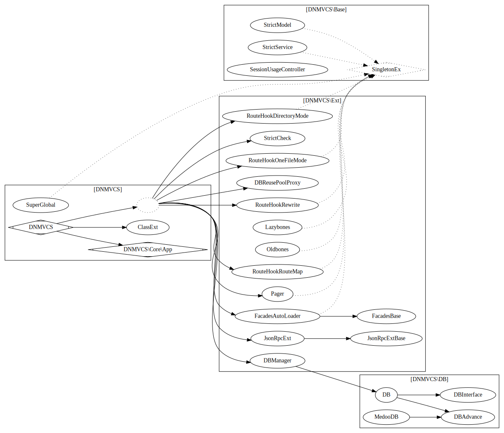

# 第一章 DNMVCS 介绍
QQ: 85811616
##  [教程](tutorial.md)

 [教程](tutorial.md)

## DNMVCS 是什么

一个 PHP Web 简单框架 

* 主要特点：比通常的 Model Controller View 多了 Service 。拟补了 常见 Web 框架少的缺层。
这个缺层导致了很糟糕的境地。你会发现很多人在 Contorller 里写一堆代码，或者在 Model 里写一堆代码。
使得网站开发者专注于业务逻辑。
* 耦合松散，扩展灵活方便，魔改容易
* 无第三方依赖，你不必担心第三方依赖改动而大费周折。
* 你的代码，基本和DNMVCS系统给库无关
* 无 composer 环境也可运行，同时支持 composer 。
* 桩代码极小，你不必在一堆杂乱代码中开始，而是像普通库那样引用
* 不仅仅支持全站路由，还支持局部路径路由和非 PATH_INFO 路由,不需要配服务器也能用

## 关于 Servivce 层

MVC 结构的时候，你们业务逻辑放在哪里？
新手放在 Controller ，后来的放到 Model ，后来觉得 Model 和数据库混一起太乱， 搞个 DAO 层吧。
可是 一般的 PHP 框架不提供这个功能。
所以，Service 按业务走，Model 层按数据库走，Controller 层按 URL 地址走，View 按页面走，这就是 DNMVCS 的理念。

DNMVCS 的最大意义是思想，只要思想在，什么框架你都可以用
你可以不用 DNMVCS 实现 Controller-Service-Model 架构。
只要有这个思想就是理念成功了。

## 理解 DNMVCS 的原则

DNMVCS 层级关系图

```text
           /-> View
Controller --> Service ------------------------------ ---> Model
         \         \   \               \  /             /    \
          \         \   \-> LibService ----> ExModel --/      \
           \         \             \                \----------->ModelHelper
            \         ---------------->ServiceHelper
             \-->ControllerHelper
```


* Controller 按 URL 入口走 调用 view 和service
* Service 按业务走 ,调用 model 和其他第三方代码。
* Model 按数据库表走，基本上只实现和当前表相关的操作。
* View 按页面走
* 不建议 Model 抛异常
* ControllerHelper,ServiceHelper,ModelHelper都为助手类，通常缩写为 C, S， M

1. 如果 Service 相互调用怎么办?
添加后缀为 LibService 用于 Service 共享调用，不对外，如MyLibService
2. 如果跨表怎么办?，三种解决方案
    1. 在主表里附加，其他表估计用不到的情况。
    2. 添加后缀为 ExModel 用于表示这个 Model 是多个表的，如 UserExModel。
    3. 或者单独和数据库不一致如取名 UserAndPlayerRelationModel

## DNMVCS 做了什么

* 简单可扩展灵活的路由方式
    * 全站 PATH_INFO 模式
    * 局部 PATH_INFO 模式
    * GET 参数的路由模式
    * 路由表的路由模式

* 简单的视图
    * PHP 本身就是模版
    * 轻松处理页眉页脚
* 扩展接管默认错误处理
* 简单的配置类
    * setting 就是一个数组， config 就是动态配置
* 简单的加载类 
* 简单可扩充的数据库管理类
    * 支持主从(手动)
    * 可扩充
    * 轻松整合 Medoo
* 所有这些仅仅是在主类里耦合。
* 为 Swoole http 服务器准备

## DNMVCS 不做什么

* ORM ，和各种屏蔽 sql 的行为，根据日志查 sql 方便多了。 自己简单封装了 pdo 。你也可以使用自己的DB类。 你也可以用第三方ORM
* 模板引擎，PHP本身就是模板引擎。
* Widget ， 和 MVC 分离违背。
* 接管替代默认的POST，GET，SESSION 。系统提供给你就用，不要折腾这些。 *除非为了支持 swoole*

## DNMVCS 还要做什么
* 范例，例子还太简单了
* 更多的杀手级应用

## DNMVCS 的 缺点

1. 不优雅。万恶之源。
2. 调用堆栈层级太少，不够 Java 。
4. 错误报告页面很丑陋。 想华丽自己写一个。不用 IDE 的直接看就懂。
5. 没有中间件。 重写 Controller 啊，要什么中间件。
6. 没有强大的全局依赖注入容器，只有万能的 G 函数。
7. 没有灵活强大的 AOP ，只有万能的 G 函数。
8. 这框架什么都没做啊。 居然只支持 PHP7 。

## 架构图


## 还有什么要说的

使用它，鼓励我，让我有写下去的动力


