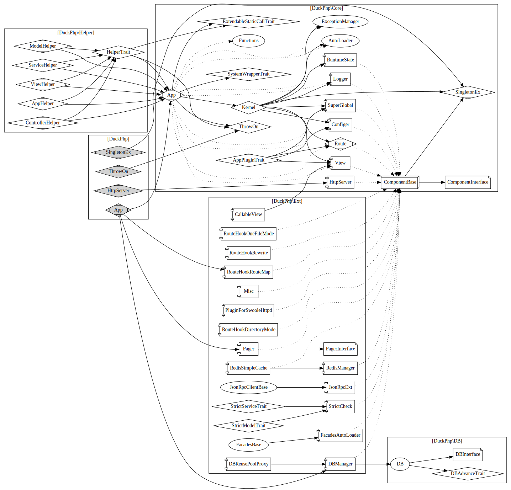

# 整体架构图
[toc]
## DuckPHP 的源代码
遵循 PSR-4 的文件结构，节点文件是 `Core/Singleton` 是所有非辅助类都以来的可变单例类。
`Core/App`, `Core/Kernel`, `Core/HttpServer` 是连接性节点。 其他节点都是独立的。

链接指向参考文件。

1. [App.php](ref/App.md) 是加载了扩展的 DuckPHP 入口 ，扩展至 Core/App

2. [HttpServer.php](ref/HttpServer.md) 是 加了 Swoole 的 Http 服务器。

3. [SingletonEx.php](ref/SingletonEx.md) 是 Core/SingletonEx.php 的快捷方法。

4. [ThrowOn.php](ref/ThrowOn.md) 是 Core/ThrowOn.php 的快捷方法。

5. Core/ 目录是核心目录，基本功能都在 Core 里实现
   1. **[SingletonEx.php](ref/Core-SingletonEx.php)**  
   2. **[ThrowOn.php](ref/Core-ThrowOn.md)** 注意这个 trait 也被 Helper使用
   3. **[App.php](ref/Core-App.md)** 是核心,引用
        1. [Kernel.php](ref/Core-Kernel.md) 核心Trait 组件
           1. [AutoLoader.php](ref/Core-AutoLoader.md)
           2. [Configer.php](ref/Core-Configer.md)
           3. [View.php](ref/Core-View.md)
           4. [Route.php](ref/Core-Route.md)
           5. 以上是核心必备组件
           6. [SuperGlobal.php](ref/SuperGlobal.md)
           7. [Logger.php](ref/Core-Logger.md)
           8. [ExceptionManager.php](ref/Core-ExceptionManager.md)  
           9. [RuntimeState.php](ref/Core-RuntimeState.md)
        2. [ExtendableStaticCallTrait.php](ref/Core-ExtendableStaticCallTrait.md) 注意这个 trait 也被 Helper使用
        3. [SystemWrapperTrait.php](ref/Core-SystemWrapperTrait.md)
   3. **[AppPluginTrait.php](ref/Core-AppPluginTrait.md) **  这个Trait用于把独立工程 App 转成插件 
   4. **[HttpServer.php](ref/Core-HttpServer.md)** 单独的 Http 服务器
  
6. DB/ 是数据库
   1. [DBAdvance.php](ref/DB-DBAdvance.md)
   2. [DBInterface.php](ref/DB-DBInterface.md)
   3. [DB.php](ref/DB-DB.md)

7. Ext/ 目录是各种扩展，粗体为默认
   1. **[DBManager.php](ref/Ext-DBManager.md)**
   2. **[Misc.php](ref/Ext-Misc.md)**
   3. **[Pager.php](ref/Ext-Pager.md)**
        1. [PagerInteface.php](ref/Ext-PagerInteface.md)
   4. **[RouteHookRewrite.php](ref/Ext-RouteHookRewrite.md)**
   5. **[RouteHookRouteMap.php](ref/Ext-RouteHookRouteMap.md)**
   6. [CallableView.php](ref/Ext-CallableView.md)
   7. [DBReusePoolProxy.php](ref/Ext-DBReusePoolProxy.md)
   8. [FacadesAutoLoader.php](ref/Ext-FacadesAutoLoader.md)
        1. [FacadesBase.php](ref/Ext-FacadesBase.md)
   9. [HookChain.php](ref/Ext-HookChain.md) 这个独立文件没用到。
   10. [JsonRpcExt.php](ref/Ext-JsonRpcExt.md)
        1. [JsonRpcClientBase.php](ref/Ext-JsonRpcClientBase.md)
   11. [PluginForSwooleHttpd.php](ref/Ext-PluginForSwooleHttpd.md)
   12. [RedisManager.php](ref/Ext-RedisManager.md)
   13. [RedisSimpleCache.php](ref/Ext-RedisSimpleCache.md)
   14. [RouteHookDirectoryMode.php](ref/Ext-RouteHookDirectoryMode.md)
   15. [RouteHookOneFileMode.php](ref/Ext-RouteHookOneFileMode.md)
   16. [StrictCheck.php](ref/Ext-StrictCheck.md)
         1. [StrictCheckModelTrait.php](ref/Ext-StrictCheckModelTrait.md)
         2. [StrictCheckServiceTrait.php](ref/Ext-StrictCheckServiceTrait.md)
   17. *[Lazybones.php](ref/Ext-Lazybones.md)*
8. Helper/ 助手类
    1. **[HelperTrait.php](ref/Helper-HelperTrait.md)**
    2. [ControllerHelper.php](ref/Helper-ControllerHelper.md)
    3. [ModelHelper.php](ref/Helper-ModelHelper.md)
    4. [ServiceHelper.php](ref/Helper-ServiceHelper.md)
    5. [ViewHelper.php](ref/Helper-ViewHelper.md)
    6. *[AppHelper.php](ref/Helper-AppHelper.md)*

## DuckPHP 全框架架构图

画成引用  [ SVG,下载查看大图 ](duckphp.gv.svg) （源文件 duckphp.gv）  如下：

钻石表示核心节点

Ext 的虚线，表示的是默认未加载的扩展。

##### 
    ExtendableStaticCallTrait
    ThrowOn  提供了 实用的 ThrowOn
    HookChain  提供 链式钩子。
    HttpServer 提供了 HttpServer 的实现。
    SystemWrapperTrait 用于 同名函数替代系统系统函数。 比如 header();