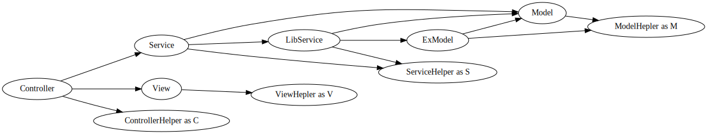

# 一般流程
[toc]
## 开发人员角色

DuckPhp 的使用者角色分为 `业务工程师`和`核心工程师`两种。

`业务工程师`负责日常 Curd 。作为`业务工程师`， 你不能引入 DuckPhp 的任何东西，就当 DuckPhp 命名空间里的东西不存在。

`核心工程师`才去研究 DuckPhp 类里的东西。做大家统一的底层代码。

## 目录结构

DuckPhp 代码里的 template 目录就是我们的工程目录示例。也是工程桩代码。

在执行 `./vendor/bin/duckphp --create` 的时候，会把代码复制到工程目录。 并做一些改动。

```text
+---app                     // psr-4 标准的自动加载目录。
|   +---Business            // 业务目录
|   |       TestService.php // 测试 Service
|   +---Controller          // 控制器目录
|   |       Main.php        // 默认控制器
|   +---Model               // 模型放在里
|   |       TestModel.php   // 测试模型
|   +---System              // 基类放在这里
|       |   App.php         // 默认框架入口文件
|       |   BaseController.php      // 控制器基类
|       |   BaseException.php       // 系统错误基类
|       |   BaseModel.php   // 模型基类
|       |   BaseService.php // 服务基类
|       \---Helper                  //助手类目录
|               AppHelper.php       // 应用助手类
|               BusinessHelper.php  // 服务助手类
|               ControllerHelper.php// 控制器助手类
|               ModelHelper.php     // 模型助手类
|               ViewHelper.php      // 视图助手类
+---config                  // 配置文件放这里
|       config.php          // 配置，目前是空数组
|       setting.sample.php  // 设置，去除敏感信息的模板
+---view                    // 视图文件放这里，可调
|   |   main.php            // 视图文件
|   \---_sys                // 系统错误视图文件放这里
|           error-404.php   // 404 页面
|           error-500.php   // 500 页面
|           error-debug.php // 调试的时候显示的视图
+---public                  // 网站目录
|       index.php           // 主页，入口页
\---start_server.php    // 启动 Htttp 服务
```
这个目录结构里，`业务工程师`只能写 `app/Controller`,`app/Model`,`app/Service`,`view` 这四个目录。
有时候需要去读 `app/Base/Helper` 目录下的的类。其他则是`核心工程师`的活。

app 目录，就是放 LazyToChange 命名空间的东西了。 app 目录可以在选项里设置成其他名字
命名空间 LazyToChange 是 可调的。比如调整成 MyProject ,TheBigOneProject  等。
可以用 `./vendor/bin/duckphp --create --namespace TheBigOneProject` 调整。

文件都不复杂。基本都是空类或空继承类，便于不同处理。
这些结构能精简么？
可以，你可以一个目录都不要。

System/App.php 这个文件的入口类继承 DuckPhp\DuckPhp 类，工程的入口流程会在这里进行，这里是`核心工程师`重点了解的类。

BaseController, BaseModel, BaseService 是你自己要改的基类，基本只实现了单例模式。

Helper 目录，助手类，如果你一个人偷懒，直接用 APP 类也行  


### 总结如何精简目录
* 移除 app/System/Helper/ 目录,如果你直接用 App::* 替代助手类。
* 移除 app/System/BaseController.php 如果你的 Controller 和默认的一样不需要基本类。
* 移除 app/System/BaseModel.php 如果你的 Model 用的全静态方法。
* 移除 app/System/BaseService.php 如果你的 Service 不需要 G() 可变单例方法。
* 移除 start_server.php 如果你使用外部 http 服务器
* 移除 config/ 目录,在启动选项里加 'skip_setting_file'=>true ，如果你不需要 config/setting.php，
    并有自己的配置方案
* 移除 view/\_sys  目录 你需要设置启动选项里 'error\_404','error\_500,'error_debug‘’。
* 移除 view 目录如果你不需要 view ，如 API 项目。
* 移除 TestService.php ， TestModel.php  测试用的东西

----


## 工程完整架构图


对应上面的文件结构，你的工程应该是这么架构。



文字版
```text
           /-> View-->ViewHelper
Controller --> Business ------------------------------ ---> Model
         \         \   \               \  /                  \
          \         \   \-> (Business)Lib ----> ExModel----------->ModelHelper
           \         \             \                
            \         ---------------->BusinessHelper
             \-->ControllerHelper
```

同级之间的东西不能相互调用

* 写 Model 你可能要引入 Base\Helper\ModelHelper 助手类别名为 M 。
* 写 Serivce 你可能要引入 Base\Helper\SerivceHelper 助手类别名为 S 。
* 写 Controller 你可能要引入 Base\Helper\ControllerHelper 助手类别名为 C 。
* 写 View 你可能要引入 Base\Helper\ViewHelper 助手类别名为 V 。
* 不能交叉引入其他层级的助手类。如果需要交叉，那么你就是错的。
* 小工程可以用直接使用入口类 MY\Base\App 类，这包含了上述类的公用方法。
* ContrllorHelper,ModelHelper,BusinessHelper,ViewHelper 如果你一个人偷懒，直接用 APP 类也行  
* Service 按业务逻辑走， Model 按数据库表名走
* LibService 其实是特殊的 Service 用于其他 Service 调用
* ExModel 是特殊 Model 表示多个表混合调用。

* 图上没显示特殊的 AppHelper

助手类教程在这里 [助手类教程](tutorial-helper.md)，基本上，看完助手类教程，`业务工程师`就可以开干了。

如果你的项目使用内置数据库，或许你还要看  [数据库教程](tutorial-helper.md)

此外有什么不了解的，问`核心工程师`吧。
比如路由方面，常见是文件路由。 [路由教程](tutorial-route.md)

## 入口文件和选项

### Web 的入口文件

和很多 Web 框架一样，我们的工程是从 public/index.php 开始的
File: `template/public/index.php`

```php
<?php declare(strict_types=1);
/**
 * DuckPhp
 * From this time, you never be alone~
 */
require_once(__DIR__.'/../../autoload.php');        // @DUCKPHP_HEADFILE
require_once __DIR__.'/../app/System/App.php';

$options =[
    //'is_debug'=>true,
];

// 设置命名空间 LazyToChange 对应的目录，但强烈建议用 composer 加载。
$options['path_namespace'] = 'app';

// 启用命令行模式， 加载命令行插件
$options['console_mode_enable'] = defined('DUCKPHP_CLI_MODE')?true:false;

echo "<div>Don't run the template file directly, Install it! </div>\n"; //@DUCKPHP_DELETE
echo "<div>不建议直接运行这文件，建议用安装模式 </div>\n"; //@DUCKPHP_DELETE

\LazyToChange\System\App::RunQuickly($options);

```
入口类前面部分是处理头文件的。

带入工程文件目录 $path ，和工程命名空间 $namespae。

然后就这句话

```php
\DuckPhp\DuckPhp::RunQuickly($options);
```
RunQuickly 相当于 \DuckPhp\DuckPhp::G()->init($options,function(){})->run(); 
\DuckPhp\DuckPhp::G()->init($options,function(){})； 会执行根据选项，返回  `LazyToChange\System\App`

为什么不是 `LazyToChange\System\App::RunQuickly($options); ` 呢？ 可以，但是这要兼容不使用外部 autoloader 的情况。如 composer  。 如果你用外部加载器，只需直接 `LazyToChange\System\App::RunQuickly($options); `。

###  工程入口文件

所以我们现在来看 `app/System/App.php` 对应的 LazyToChange\System\App 类就是入口了。

File: `template/app/System/App.php`

```php
<?php declare(strict_types=1);
/**
 * DuckPhp
 * From this time, you never be alone~
 */

namespace LazyToChange\System;

use DuckPhp\DuckPhp;

class App extends DuckPhp
{
    //@override
    public $options = [
        // 'use_setting_file' => false,
        // 'use_setting_file' => true,
        
        //'is_debug' => false,
        'is_debug' => true,
        
        //'platform' => '',
        'platform' => 'platform', // @DUCKPHP_DELETE
        
        
        'error_404' => '_sys/error_404',
        'error_500' => '_sys/error_500',
        'error_debug' => '_sys/error_debug',
        
        //'path_info_compact_enable' => false,
        //'path_info_compact_enable' => true, // @DUCKPHP_DELETE
    ];
    public function __construct()
    {
        parent::__construct();
        $options = [];

        // @autogen by tests/genoptions.php
// 【省略选项注释】
        // @autogen end
        
        $this->options = array_replace_recursive($this->options, $options);
    }
    //@override
    protected function onPrepare()
    {
        //your code here
    }
    //@override
    protected function onInit()
    {
        // your code here
    }
    //@override
    protected function onRun()
    {
        // your code here
    }
}

```
这里的代码省略了一大堆注释，这些注释选项，都是默认选项。和打开的效果是一样的。

 //@override 注释都是用于重写的。

在构造父方法里，我们合并了一大堆注释的选项以做不同选择。

后面我们开始解释这些代码。

### // @DUCKPHP 开始的注解
 我们是看 template 文件夹看到一些  // @DUCKPHP 开始的注解。在安装脚本运行之后，实际这些注解的行会有特殊变动。
共有4个注解

+ // @DUCKPHP_DELETE 模板引入后删除
+ // @DUCKPHP_HEADFILE 头文件调整
+ // @DUCKPHP_NAMESPACE 调整命名空间
+ // @DUCKPHP_KEEP_IN_FULL 如果是 --full 选项则保留。

### 关于选项

术语 `选项`和 `设置`， `配置 相区分如下：

- 选项 ，传递给入口类的内容
- 配置，可有可无的配置文件。
- 设置，配置的 setting 文件，敏感信息

index.php 中的 $options , app/Base/App.php 的 在初始化的时候都会传递合并入入口类的 $options 公开属性里。
在 App 类的代码里，还留有一大堆排序后的注释选项。打开后也合并如 options 公开属性。
这些注释选项代码和默认的是一致的。

DuckPhp 只要更改选项就能实现很多强大的功能变化。
如果这些选项都不能满足你，那就启用扩展吧，这样有更多的选项能用。
如果连这都不行，那么，就自己写扩展吧。

参考 [参考索引页的选项部分](ref/index.md) 获得所有选项信息


### 基本选项详解

DuckPhp 的示例文件，注释的都是默认选项，没使用默认注释选项的，这里说明一下。

'path'=>$path,

    基本路径，其他配置会用到这个基本路径。
'namespace' =>$namespace，

    工程的 autoload 的命名空间，和很多框架限定只能用 App 作为命名空间不同，DuckPHP 允许你用不同的命名空间

'path_namespace'=>'app',

    默认的 psr-4 的工程路径。可使用绝对路径

**'skip_setting_file'=> false,**

    新手之一最容易犯的错就是，没把这项设置为 true.
    这个选项的作用是跳过读取 setting.php  敏感文件。
    为什么要这么设置， 防止传代码上去而没传设置文件。
    造成后面的错误。

'is_debug'=>false,

    配置是否在调试状态。
'platform'=>'',

    配置开发平台 * 设置文件的  platform 会覆盖
error_* 选项为 null 用默认，为 callable 是回调，为string 则是调用视图。

'error_debug'=>'_sys/error-debug',

    is_debug 打开情况下，显示 Notice 错误
'error_404'=>'_sys/error-404'

    404 页面
'error_500'=>'_sys/error-500'

    500 页面，异常页面都会在这里


## 请求流程和生命周期

怎么就从 DuckPhp\DuckPhp 切到 LazyToChange\System\App 类了？

index.php 就只执行了

DuckPhp\DuckPhp::RunQuickly($options, $callback) 

发生了什么

等价于 DuckPhp\DuckPhp::G()->init($options)->run();

init 为初始化阶段 ，run 为运行阶段。$callback 在init() 之后执行

#### init 初始化阶段

    处理是否是插件模式
    处理自动加载  AutoLoader::G()->init($options, $this)->run();
    处理异常管理 ExceptionManager::G()->init($exception_options, $this)->run();
    checkOverride() 检测如果有覆盖类，切入覆盖类（LazyToChange\System\App）继续 
    接下来是 initAfterOverride;

#### initAfterOverride 初始化阶段

    调整选项 initOptions()
    调整外界 initContext()
    调用用于重写的 onPrepare(); 
    初始化默认组件 initDefaultComponenents()
    加入扩展 initExtends()
    调用用于重写的  onInit();

#### run() 运行阶段

    处理 setBeforeRunHandler() 引入的 beforeRunHandlers
    异常准备
        beforeRun()；
            重制 RuntimeState 并设置为开始
            绑定路由
        * onRun ，可 override 处理这里了。
        ** 开始路由处理 Route::G()->run();
        如果返回 404 则 On404() 处理 404
    如果发生异常
        进入异常流程
    清理流程
#### clear 清理
只有一个动作： 设置 RuntimeState 为结束

## 重写入口类
### 请求流程中添加你的代码


属性 options_project 的数据会合并入 $this->options 。工程额外选项请在这里添加

+ protected function onPrepare() 
	用于替换默认组件等。

+ protected function onInit() 
	在初始化结束之后执行。要在初始化完成后做额外工作就在这里加了。

+ protected function onRun()
	运行阶段执行。

核心工程师重写这三个方法，就能给你的工程带来多种多样的变化了。

### 接管替换默认实现

你可以在 onPrepare() 方法里替换默认的实现。
```php
Route::G(MyRoute::G());
View::G(MyView::G());
Configer::G(MyConfiger::G());
RuntimeState::G(MyRuntimeState::G());
```

例外的是 AutoLoader 和 ExceptionManager 。 这两个是在插件系统启动之前启动

所以你需要：
```php
AutoLoader::G()->clear();
AutoLoader::G(MyAutoLoader::G())->init($this->options,$this);

ExceptionManager::G()->clear();
ExceptionManager::G(MyExceptionManager::G())->init($this->options,$this);
```
如何替换组件。

为了 onInit 使用方便

* 为什么 Core 里面的都是 App::Foo(); 而 Ext 里面的都是 App::G()::Foo();
因为 Core 里的扩展都是在 DuckPhp\Core\App 下的。

Core 下面的扩展不会单独拿出来用。如果你扩展了该方面的类，最好也是让用户通过 App 或者 MVCSA 助手类来使用他们。


接下来是[路由](tutorial-route.md)这一章教程，  Route::G()->run() 的具体内容

### 加载扩展

DuckPhp 扩展的加载是通过选项里添加，$options['ext']数组实现的

    扩展映射 ,$ext_class => $options。
    
    $ext_class 为扩展的类名，如果找不到扩展类则不启用。
    $ext_class 满足组件接口。在初始化的时候会被调用。
    $ext_class->init(array $options,$context=null); // context 为 DuckPhp 的实现类。
    
    如果 $options 为 false 则不启用，
    如果 $options 为 true ，则会把当前全局 $options 传递进去。

