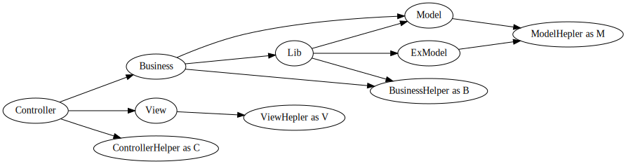

# 助手类
**重要，本文对业务工程师很重要**

[toc]
## 相关类

从简单到复杂，我们列出助手类。

- [DuckPhp\Helper\ViewHelper](ref/Helper-ViewHelper.md)  视图助手类 [DuckPhp\Helper\ViewHelperTrait](ref/Helper-ViewHelperTrait.md) 
- [DuckPhp\Helper\ModelHelper](ref/Helper-ModelHelper.md) 模型助手类   [DuckPhp\Helper\ModelHelperTrait](ref/Helper-ModelHelperTrait.md) 
- [DuckPhp\Helper\BusinessHelper](ref/Helper-BusinessHelper.md) 业务助手类
[DuckPhp\Helper\BusinessHelperTrait](ref/Helper-BusinessHelperTrait.md) 
- [DuckPhp\Helper\ControllerHelper](ref/Helper-ControllerHelper.md) 控制器助手类
[DuckPhp\Helper\ContorllerHelperTrait](ref/Helper-ControllerHelperTrait.md) 

- *[DuckPhp\Helper\AdvanceHelper](ref/Helper-AdvanceHelper.md)* 高级助手类，一般不常用。
[DuckPhp\Helper\AdvanceHelperTrait](ref/Helper-AdvanceHelperTrait.md)

## 开始
助手类是 `业务工程师` 必须掌握的类。
我们搬出架构图。


文字版

```text
           /-> View-->ViewHelper
Controller --> Business ------------------------------ ---> Model
         \         \   \               \  /                  \
          \         \   \-> (Business)Lib ----> ExModel----------->ModelHelper
           \         \             \                
            \         ---------------->BusinessHelper
             \-->ControllerHelper
```
上述构架图省略了命名空间。


作为 `业务工程师` ， 你不能引入 DuckPhp 的任何东西，就当 DuckPhp 命名空间不存在。
核心工程师才去研究 DuckPhp 类的东西。

假设你的工程的命名空间是 LazyToChange 。

* 写 Model 你可能要引入 LazyToChange\Helper\ModelHelper 助手类别名为 M 。
* 写 Business 你可能要引入 LazyToChange\Helper\BusinessHelper 助手类别名为 B 。
* 写 Controller 你可能要引入 LazyToChange\Helper\ControllerHelper 助手类别名为 C 。
* 写 View 你可能要引入 LazyToChange\Helper\ViewHelper 助手类别名为 V 。
* 不能交叉引入其他层级的助手类。如果需要交叉，那么你就是错的。
* 小工程可以用直接使用入口类 LazyToChange\System\App 类 甚至  DuckPhp\DuckPhp 类，这包含了上述类的公用方法。
* App 类包含助手类的全部内容。但是不推荐使用 App 类的助手类方法代替助手类。

工程的命名空间 LazyToChange 是 可调的。比如调整成 LazyToChangeProject ,TheBigOneProject  等。
参见 `$options['namespace']` 选项;

## 小问答

问：为什么这个方法在助手类的声明里查不到?

答：查看相应助手类方法 `GetExtendStaticMethodList()` ，因为 `__callStatic($name, $arguments)` 魔术方法已经被接管。在里面实现。

问：为什么我的结果和这里的结果不同？

答：`核心工程师`可以修改所有方法的实现。

问：为什么有些方法是大写开始，有些方法是小写开始。

答：大写开始的方法是常用方法，小写开始的方法是不常用方法。高级来说，大写开始方法对应一个静态函数。小写方法是对应动态函数。但是他们都可以更改实现。

问：上面调用关系图怎么没有 `AdvanceHelper` 类

答：`AdvanceHelper` 助手类只由`核心工程师`来调用 。当你要从 App 类里找出复杂的助手类，还不如在 AdvanceHelper 里找。Session 管理就用到了 AdvanceHelper 类。

## 全局助手函数

全局助手函数主要有两部分，一部分是调试用的函数，另一部分是视图调用的函数。 DuckPhp 的全局助手类都是以两条下划线爱是，并且尽量减少对全局空间的污染。

### 调试函数

_\_is_debug()

    对应 App::IsDebug() 判断是否在调试状态, 默认读取选项 is_debug 和设置字段里的 duckphp_is_debug
_\_is_real_debug()

    对应 App::IsRealDebug() 。 切莫乱用。用于环境设置为其他。比如线上环境，但是还是要特殊调试的场合。 如果没被接管，和 IsDebug() 一致。
_\_platform()

    对应 App::Platform() 获得当前所在平台,默认读取选项和设置字段里的 duckphp_platform，用于判断当前是哪台机器等
_\_trace_dump(...$arg)

    对应 App::TraceDump() 调试状态下，查看当前堆栈，打印当前堆栈，类似 debug_print_backtrce(2)
_\_var_dump(...$arg)

    对应 App::var_dump()调试状态下 Dump 当前变量，替代 var_dump
_\_debug_log(...$arg)

    对应 App::DebugLog($message, array $context = array()) 对应调试状态下 Log 当前变量。
### 显示相关函数

全局助手函数用于 View 视图里

__h()

    对应 App::H(); HTML 编码
__l($str,$args=[])

    对应 App::L(); 语言处理函数，后面的关联数组替换 '{$key}'
__hl($str, $args=[])

    对应 App::Hl(); 对语言处理后进行 HTML 编码
__url($url)

    对应 App::Url(); 获得相对 url 地址
__domain()

    对应 App::Domain(); 获得带协议头的域名
__display($view, $data = null)

    对应 App::Display(); 包含下一个 $view ， 如果 $data = null 则带入所有当前作用域的变量。 否则带入 $data 关联数组的内容。用于嵌套包含视图。


## ViewHelper 视图助手类

ViewHelper 是在视图里使用，默认没有方法。


## ModelHelper 模型助手类

ModelHelper 用于 Model 层。  ModelHelper 有数据库的三个独特方法。

这几个方法在 ControllerHelper 里没有。 如何使用 Db 对象，看数据库部分的介绍。

此外，还有两个快捷方法， SqlForPager  和 SqlForCountSimply 方便分页。


    public static function Db($tag = null)
获得 Db 对象
参见  [DuckPhp\Component\DbManager::Db](Component-DbManager.md#Db)

    public static function DbForRead()
获得只读用的 Db 对象 public static function DbForRead() 
参见 [DuckPhp\Component\DbManager::DbForRead](Component-DbManager.md#DbForRead)

    public static function DbForWrite()
获得读写用的 Db 对象
参见 [DuckPhp\Component\DbManager::DbForWrite](Component-DbManager.md#DbForWrite)

    public static function SqlForPager(string $sql, int $pageNo, int $pageSize = 10): string
分页 limit 的 sql,补齐 sql用

    public static function SqlForCountSimply(string $sql): string
简单的把 `select ... from ` 替换成 `select count(*)as c from `
用于分页处理。

## BusinessHelper 业务助手类

BusinessHelper 用于业务层。三个配置相关方法，两个事件方法，和两个其他方法。

    public static function Setting($key)
获得设置信息

    public static function Config($key, $file_basename = 'config')
获得配置

    public static function LoadConfig($file_basename)
获得配置数组

    public static function FireEvent($event, ...$args)
触发事件

    public static function OnEvent($event, $callback)
绑定事件

    public static function Cache($object = null)
获得缓存对象

    public static function XpCall($callback, ...$args)
调用，如果产生异常则返回异常，否则返回正常数据

## ControllerHelper 控制器的助手类

 ContrlloerHelper 的方法很多很杂，但掌握了 ContrlloerHelper 方法，基本就掌握了使用方法

大致分为 【显示相关】【配置相关】【跳转相关】【路由处理】【异常管理】【跳转】【内容处理】 几块 内容处理和 ViewHelper 基本通用。 ControllerHelper 方法

### 超全局变量
替代同名 $\_GET / $\_POST /$\_REQUEST /$\_COOKIE/$\_SERVER 。如果没的话返回后面的默认值。如果 $key 为 null 返回整个数组。
```php
    public static function GET($key = null, $default = null)
    public static function POST($key = null, $default = null)
    public static function REQUEST($key = null, $default = null)
    public static function COOKIE($key = null, $default = null)
    public static function SERVER($key, $default = null)
```
### 字符串处理

    public static function H($str)
\_\_h()； HTML 编码

    public static function Json($data)
\_\_json()； Json 编码

    public static function L($str, $args = [])
\_\_l() 语言处理函数，后面的关联数组替换 '{$key}'
    
    public static function Hl($str, $args = [])
\_\_hl() 对语言处理后进行 HTML 编码
### 显示处理
    public static function Render($view, $data = null)
渲染

    public static function Show($data = [], $view = '')
显示视图

    public static function setViewHeadFoot($head_file = null, $foot_file = null)
设置页眉页脚

    public static function assignViewData($key, $value = null)
分配视图变量。 特殊场合使用。

### 配置
    public static function Setting($key)
设置是敏感信息,不存在于版本控制里面。而配置是非敏感。

    public static function Config($key, $file_basename = 'config')
读取配置，从 config/$file_basename.php 里读取配置

    public static function LoadConfig($file_basename)
载入配置,获得配置项目。

### 跳转

跳转方法的 $exit 为 true 则附加 exit()

    public static function ExitRedirect($url, $exit = true)
跳转到站内 Url

    public static function ExitRedirectOutside($url, $exit = true)
跳转到站外 Url 。这两个函数分开是为了安全起见

    public static function ExitRouteTo($url, $exit = true)
跳转到相对 url 

    public static function Exit404($exit = true)
报 404，显示后续页面

    public static function ExitJson($ret, $exit = true)
输出 json 结果。

### 路由相关

    public static function Url($url)
获得相对 url 地址

    public static function Domain($use_scheme = false)
获得带协议的域名

    public static function Parameter($key, $default = null)
和超全局变量类似，获得存储的数据

    public static function getPathInfo()
获取当前 PathInfo
    public static function getRouteCallingMethod()
获取正在调用的路由方法，构造函数里使用。

    public static function setRouteCallingMethod($method)
设置调用的路由方法， 强行改变 view 的默认行为时候用。

### 系统兼容替换
和系统同名函数(header/setcookie/exit)功能一致，目的是为了兼容性
```php
    public static function header($output, bool $replace = true, int $http_response_code = 0)
    public static function setcookie(string $key, string $value = '', int $expire = 0, string $path = '/', string $domain = '', bool $secure = false, bool $httponly = false)
    public static function exit($code = 0)
```

### 分页相关
分页器类是通过 DuckPhp\\Component\\Pager 实现的

    public static function PageNo($new_value = null)
获得或设置当前页码

    public static function PageSize($new_value = null)
获得或设置当前每页数据条目
    
    public static function PageHtml($total, $options = [])
获得分页结果 HTML，这里的 $options 是传递给 Pager 类的选项。

### 异常处理

    public static function assignExceptionHandler($classes, $callback = null)
分配异常类回调

    public static function setMultiExceptionHandler(array $classes, $callback)
给多个异常类都帮定到一个回调处理

    public static function setDefaultExceptionHandler($callback)
设置默认的异常处理

### 其他控制器助手方法

    public static function DbCloseAll()
手动关闭数据库

    public static function XpCall($callback, ...$args)
调用 callback, 如果有异常则返回异常对象

    public static function FireEvent($event, ...$args)
触发事件

    public static function OnEvent($event, $callback)
给事件绑定回调

    public static function dumpAllRouteHooksAsString()
打印所有路由钩子，调试用


## AdvanceHelper 高级助手类

AdvanceHelper 是 `核心工程师` 才使用的高级助手类。特殊的 Business 会用到。

一部分只是展示了 App 类里有的非主要生命周期流程外的方法。


### 系统替代

AdvanceHelper 的系统替代更全面，包括 session 族函数

header

    【系统替代】 header 函数以兼容命令行模式
setcookie()

    【系统替代】 setcookie 函数以兼容命令行模式
exit

    【系统替代】 退出函数，以便于接管
set_exception_handler(callable $exception_handler)

    【系统替代】 用于 swoole 中特殊用处
register_shutdown_function(callable $callback, ...$args)

    【系统替代】 用于 swoole 中特殊用处
session_start(array $options = [])

    【系统替代】
session_id($session_id = null)

    【系统替代】
session_destroy()

    【系统替代】
session_set_save_handler(\SessionHandlerInterface $handler)

    【系统替代】
### 常用操作

isRunning()

    判断是否在运行状态
isInException()

    判断是否在异常中
addRouteHook($hook, $position, $once = true)

    给路由添加钩子，见相关文档
setUrlHandler($callback)

    实现自己的 URL 函数
assignPathNamespace($path, $namespace = null)

    自动载入
CallException($ex)

    调用异常处理，一般也不用，而是看异常处理那章

## 助手类的公用静态方法

所有助手类都有的静态方法。
GetExtendStaticStaticMethodList()

    用来查看当前类有什么额外的静态方法。
\_\_callStatic

    静态方法已经被扩展。
AssignExtendStaticMethod($key, $value = null)

    高级函数
CallExtendStaticMethod($name, $arguments)

    高级函数
## 其他 DuckPhp 类自带的非助手函数静态方法

这里顺带介绍 DuckPhp 的非助手函数静态方法。 这些函数都是内部调用。

Blank()

    空函数，用于可能的特殊场合
On404

    404 处理函数
OnDefaultException

    默认异常处理函数
OnDevErrorHandler

    默认Notice等错误处理函数
RunQuickly

    重点，快速运行
system_wrapper_replace

    替换系统默认同名函数
system_wrapper_get_providers

    获得系统默认同名函数

## 高级话题：添加或修改助手类的方法 

扩展 助手类。 最直接的方式就是  添加静态方法。

一般工程，都会自 DuckPhp 的助手类 扩展自己的助手类，而不是直接使用 DuckPhp 的助手类。

类似 自己对 ModelHelper 扩展:

```php
<?php
namespace LazyToChange\Helper;

use DuckPhp\Helper\ModelHelper as Helper;

class ModelHelper extends Helper
{
    // override or add your code here
}

```
如果你要修改相关实现，了解 DuckPhp 系统架构后后 参考 [DuckPhp\Core\App](ref/Core-App.md)
如果你自己添加了 Ext 扩展类，那么你需要 `extendComponents` 方法注入相关 Helper
如果你只是替换系统的实现， 找出那些 Helper 的实现函数，替换之。