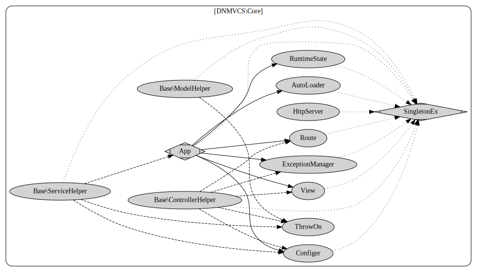

# DNMVCS 教程
## 快速入门
### 安装
假定不管什么原因，选用了 DNMVCS 这个框架，需要快速入门.

最快的方式是从 github 下载 DNMVCS。

到所在目录之下运行

```bash
php template/bin/start_server.php
```
浏览器中打开 http://127.0.0.1:8080/ 得到下面欢迎页就表明 OK 了
```text
Don't run the template file directly
Hello DNMVCS

Time Now is [2019-04-19T21:36:06+08:00]
For More Take the DNMVCS-FullTest (TODO)
```
当然，你也可以用 composer 安装

```bash
composer require dnmvcs/framework
```
然后类似的执行命令
```bash
php bin/start_server.php
```
发布的时候，把网站目录指向 public/index.php 就行。

### 第一个任务
路径： http://127.0.0.1:8080/test/done  
作用是显示当前时间的任务。

对照目录结构我们要加个 test/done 显示当前时间

都在各代码段里注释了文件所在相对工程目录的位置

### View 视图
先做出要显示的样子。
```php
<?php // view/test/done.php ?>
<!doctype html><html><body>
<h1>test</h1>
<div><?=$var ?></div>
</body></html>
```
### Controller控制器
写 /test/done 控制器对应的内容
```php
<?php
// app/Controller/test.php
namespace MY\Controller;

// use MY\Base\BaseController;
use MY\Base\ControllerHelper as C;
use MY\Service\MiscService;

class test // extends BaseController
{
    public function done()
    {
        $data=[];
        $data['var']=C::H(MiscService::G()->foo());
        C::Show($data); // C::Show($data,'test/done');
    }
}
```
控制器里，我们处理外部数据，不做业务逻辑，业务逻辑在 Service 层做。

BaseController  这个基类，如果不强制要求也可以不用。

MY 这个命名空间前缀可在选项 ['namespace'] 中变更。

C::H 用来做 html编码。

C::Show($data); 是 C::Show($data,'test/done'); 的缩写， 调用 test/done 这个视图。

### Service 服务
业务逻辑层。
```php
<?php
// app/Service/MiscService.php
namespace MY\Service;

use MY\Base\ServiceHelper as S;
use MY\Base\BaseService;
use MY\Model\NoDB_MiscModel;

class MiscService extends BaseService
{
    public function foo()
    {
        $time=NoDB_MiscModel::G()->getTime();
        $ret="<".$time.">";
        return $ret;
    }
}
```
BaseService 也是不强求的，我们 extends BaseService 是为了能用 G 函数这个单例方法

这里调用了 NoDB_MiscModel 

### Model 模型

完成 NoDB_MiscModel 。

Model 类是实现基本功能的。

这里用 NoDB_ 前缀表示我们没使用到数据库。

```php
<?php
// app/Model/NoDB_MiscModel.php
namespace MY\Model;

use MY\Base\BaseModel;
use MY\Base\ModelHelper as M;

class NoDB_MiscModel extends BaseModel
{
    public function getTime()
    {
        return DATE(DATE_ATOM);
    }
}
```
同样 BaseModel 也是不强求的，我们 extends BaseModel 是为了能用 G 函数这个单例方法

### 最后显示结果
```text
test

<2019-04-19T22:21:49+08:00>
```
## 应用程序员核心参考

### 本章说明
DNMVCS 的使用者角色分为 应用程序员，和核心程序员两种
应用程序员负责日常 Curd 。核心程序员做的是更高级的任务。
应用程序员读完

本章之后，还有一章是补完应用程序员高级功能的篇章。
将会讲解到高级应用，如数据库等。

### 完整架构图

同级之间的东西不能相互调用
### 开始编码之前

命名空间 MY 是 可调的。比如调整成 MyProject ,TheBigOneProject  等（$options['namespace']）

作为应用程序员， 你不能引入 DNMVCS 的任何东西，就当 DNMVCS 命名空间不存在。
核心程序员才去研究 DNMVCS 类的东西。

* 写 Model 你可能要引入 MY\Base\ModelHelper 助手类别名为 M 。
* 写 Serivce 你可能要引入 MY\Base\SerivceHelper 助手类别名为 S 。
* 写 Controller 你可能要引入 MY\Base\ControllerHelper 助手类别名为 C 。
* 不能交叉引入其他 Helper 类。如果需要交叉，那么你就是错的。

Model, Service 以及助手类都有静态的 G 函数， G() 函数就是可变单例函数。
当你用到助手类的 G 函数的形式的时候，说明你这个功能不常用。

### Model 编写模型用到的方法
 
M::ThrowOn($flag,$messsage,$code=0,$exception_class=null);
抛异常 如果 flag 成立，抛出 $exception_class(默认为 Exception 类);

如果要使用数据库，见后文。

### Serivce 编写服务用到的方法

S::ThrowOn() 和 M::ThrowOn 一样;

此外还有

* S::IsDebug(); 判断是否在调试状态 ;
* S::Platform(); 判断所在平台 ;
* S::Setting($key); 获得设置  默认设置文件是在  config/setting.php 。
* S::LoadConfig($key,$basename); 载入配置 
* S::Config($key); 获得配置 

设置是敏感信息,不存在于版本控制里面。而配置是非敏感。

### Controller 编写控制器用到的方法

和 Service 的同名同作用方法。

* C::IsDebug();
* C::Platform();
* C::Setting($key);
* C::Config($key);
* C::LoadConfig($key,$basename)

除去  Service 的同名方法 外，还有

##### 1. 显示相关的

    C::Show($data,$view=null);

    显示视图用  如果view 是空等价于 控制器名/方法名 的视图。
    最偷懒的是调用 C::Show(get_defined_vars());

    C::ShowBlock($view,$data=null);
    
    如果只显示一块，用  如果$data 是空，把父视图的数据带入，
    
    C::setViewWrapper($view_header,$view_footer)
    在控制器的构造函数中。用  来设置页眉页脚。
    
    页眉页脚的变量和 view 页面是同域的。 用 C::setViewWrapper(null,null) 清理页眉页脚。
    另 C::ShowBlock 没用到页眉页脚。而且 C::ShwoBlock 只单纯输出，不做多余动作。

    C::assignViewData($name,$var); 设置视图的输出。

    C::H($str); HTML 编码用  $str 可以是数组。

##### 2. 跳转退出方面

    404 跳转退出 C::Exit404();
    302 跳转退出 C::ExitRedirect($url);
    302 跳转退出内部地址 C::ExitRouteTo($url);
    输出 Json 退出  C::ExitJson($data);
##### 3. 路由相关
    C::URL($url) 获取相对 url;
    C::getRouteCallingMethod() 获取当前调用方法。常用于构造函数里做权限判断。
    C::Parameters() 获取切片。在DNMVCS/Framework 中扩展成其他用途
    C::Parameters() 获取切片，对地址重写有效。
##### 4. 系统替代函数 

    用 C::header() 代替系统 header 兼容命令行等。
    用 C::setcookie() 代替系统 setcookie 兼容命令行等。
    用 C::exit_system() 代替系统 exit; 便于接管处理。 
    用 C::set_exception_handler() 代替系统 set_exception_handler 便于接管处理。
    用 C::register_shutdown_function() 代替系统 set_exception_handler 便于接管处理。
##### 5. 异常相关

    如果想接管默认异常，用 C::setDefaultExceptionHandler($handler);
    如果对接管特定异常，用 C::assignExceptionHandler($exception_name,$handler);
    设置多个异常到回调则用 C::setMultiExceptionHandler($exception_name=[],$handler);

### 入口类 App 类的方法 以及高级程序员。

MY\Base\App 是 继承扩展 DNMVCS\Core\App 类的方法。

DNMVCS\Core\App 类在 初始化 之后，会切换入这个子类走后面的流程。

MY\Base\App 重写 override 的两个重要方法

onInit();

    用于初始化，你可能会在这里再次调整  $this->options。
onRun();

    用于运行前，做一些你想做的事
《聚合方法》

    ModelHelper,SerivceHelper,ControllerHelper 都在 App 类里有实现。
    这用于你想偷懒，直接 App::foo(); 的情况。
addRouteHook($hook,$prepend=false,$once=true)

    添加路由钩子 
    $hook 返回空用默认路由处理，否则调用返回的回调。

addBeforeShowHandler($callback)

    添加显示前处理
addBeforeRunHandler($callback)

    添加运行前处理
其他方法

    其他方法有待你的发掘。如果你要用于特殊用处的话。
### 目录结构
在看默认选项前， 我们看工程的桩代码,默认目录结构

```text
+---app                     // psr-4 标准的自动加载目录
|   +---Base                // 基类放在这里
|   |      App.php          // 默认框架入口文件
|   |      BaseController.php    // 控制器基类
|   |      BaseModel.php        // 模型基类
|   |      BaseService.php      // 服务基类
|   |      ContrllorHelper.php  // 控制器助手类
|   |      ModelHelper.php      // 模型助手类
|   |      ServiceHelper.php    // 服务助手类
|   +---Controller          // 控制器目录
|   |       Main.php        // 默认控制器
|   +---Model               // 模型放在里
|   |       TestModel.php   // 测试模型
|   \---Service             // 服务目录
|           TestService.php // 测试 Service
+---bin
|       start_server.php    // 启动服务
+---config                  // 配置文件放这里
|       config.php          // 配置，目前是空数组
|       setting.sample.php  // 设置，去除敏感信息的模板
+---headfile                // 头文件处理
|       headfile.php        // 头文件处理
+---view                    // 视图文件放这里，可调
|   |   main.php            // 视图文件
|   \---_sys                // 系统错误视图文件放这里
|           error-404.php   // 404 页面
|           error-500.php   // 500 页面
|           error-debug.php // 调试的时候显示的视图
|           error-exception.php // 异常页面
\---public                  // 网站目录
        index.php           // 主页，入口页
```

    文件都不复杂。基本都是空类或空继承类，便于不同处理。
    这些结构能精简么？
    可以，你可以一个目录都不要。

    BaseController, BaseModel, BaseService 是你自己要改的基类，基本只实现了单例模式。
    ContrllorHelper,ModelHelper,ServiceHelper 如果你一个人偷懒，直接用 APP 类也行  
    headfile 目录是为了直接命令行运行 template 的文件，你可以改 入口文件去掉。

### 入口文件

我们看入口类文件 public/index.php

```php
<?php
require(__DIR__.'/../headfile/headfile.php');

$options=[];
if (defined('DNMVCS_WARNING_IN_TEMPLATE')) {
    $options['is_debug']=true;
    $options['skip_setting_file']=true;
    echo "<div>Don't run the template file directly </div>\n";
}

$path=realpath(__DIR__.'/..');
$options['path']=$path;
$options['namespace']='MY';
\DNMVCS\DNMVCS::RunQuickly($options, function () {
});
// \DNMVCS\DNMVCS::G()->init($options)->run();
/*
var_export(\DNMVCS\DNMVCS::G()->options);
```
入口类前面部分是处理头文件的。
然后处理直接 copy 代码提示，不要直接运行。
起作用的主要就这句话

    \DNMVCS\DNMVCS::RunQuickly($options, function () {
    });
相当于后面调用的 // \DNMVCS\DNMVCS::G()->init($options)->run();

init, run 分两步走的模式。

最后留了 dump 选项的语句。

接下来我们看 $options 里可以选什么

### 核心基本选项
```php
const DEFAULT_OPTIONS=[
    //// basic ////
    'path'=>null,               // 基本目录, 其他目录依赖的基础目录，自动处理 “/”。
    'namespace'=>'MY',          // 工程的 autoload 的命名空间
    'path_namespace'=>'app',    // 工程对应的命名空间 目录
    
    'skip_app_autoload'=>false, // 如果你用compose.json 设置加载 app 目录，改为 true;
    
    //// properties ////
    'override_class'=>'Base\App',   
                                // 基类，后面详细说明
    'is_debug'=>false,          // 是否是在开发状态
    'platform'=>'',             //  配置平台标志，Platform 函数得到的是这个
    'reload_for_flags'=>true,   // 从设置文件里重新加载 is_debug,platform 选项
    'enable_cache_classes_in_cli'=>true, 
                                // 命令行下缓存 类数据
    'skip_view_notice_error'=>true,
                                // view 视图里忽略 notice 错误。
    'skip_404_handler'=>false,  // 404 由外部处理。
    'ext'=>[],                  // 扩展
    
    //// error handler ////
    'error_404'=>'_sys/error-404',
                                // 404 页面
    'error_500'=>'_sys/error-500',
                                // 错误页面
    'error_exception'=>'_sys/error-exception',  
                                // 异常页面
    'error_debug'=>'_sys/error-debug',
                                // 调试页面

];
```

这是基础的，后面还有一大堆的配置。
其他组件的配置，也可以写在这里。

总之，这里很明白了。

##### 基本选项
'path'=>null,

    基本路径，其他配置会用到这个基本路径。
'namespace' =>=>'MY',

    工程的 autoload 的命名空间
'path_namespace'
    默认的 psr-4 的工程路径配合 skip_app_autoload  使用。

'override_class'=>'Base\App',

    **重要选项**
    基于 namespace ,如果这个选项的类存在，则在 init 的时候会切换到这个类完成后续初始化，并返回这个类的实例。
    注意到 app/Base/App.php 这个文件的类 MY\Base\App extends DNMVCS\DNMVCS;
    如果以  \ 开头则是绝对 命名空间

    配置开发平台 * 设置文件的  platform 会覆盖

    
'skip_view_notice_error'=>true,

    view 视图里忽略 notice 错误。
'reload_for_flags'=>true,

    从设置里重载 is_debug 和 platform
skip_404_handler

    不处理404，用于你想在流程之外处理404的情况
##### 错误处理

error_* 选项为 null 用默认，为 callable 是回调，为string 则是调用视图。

    error_500 选项 是应对 Error,error_exception 选项是应对 exception
'error_debug'=>'_sys/error-debug',

    is_debug 打开情况下，显示 Notice 错误

##### "ext" 选项和扩展

ext 是一个选项，这里单独成一节是因为这个选项很重要。涉及到 DNMVCS 的扩展系统

在 DNMVCS/Core 里， ext 是个空数组。

    扩展映射 ,$ext_class => $options。

    如果 $options 为  false 则不启用，
    如果 $options 为 true ，则会把当前 $options 传递进去。

    $ext_class 为扩展的类名
    如果找不到扩展类则不启用。
    
    $ext_class 满足接口
    $ext_class->init(array $options,$context);

### 其他核心组件选项

本章介绍的是核心扩展的选项，这些选项，可以通过修改 App 类的 $options 里设置。

#### 可变单例 G 方法
这里，对之前的 G 方法统一说明
G 方法表面上是个单例函数，实际上的可替换的。
DNMVCS 系统组件的连接，多是以调用类的可变单例来实现的。


#### Configer
```
'path'=>null,
'path_config'=>'config',    //配置路径目录
'all_config'=>[],
'setting'=>[],
'setting_file'=>'setting',
'skip_setting_file'=>false,
```
Core\Configer 的选项共享个 path,带个 path_config

path_config 如果是 / 开始的，会忽略 path 选项

    当你想把配置目录 放入 app 目录的时候，调整 path_config
    当我们要额外设置，配置的时候，把 setting , all_config 的值 带入
    当我们不需要额外的配置文件的时候  skip_setting_file 设置为 true

#### View
```  
'path'=>null,
'path_view'=>'view',
```
Core\View 的选项共享一个 path,带一个 path_view.

path_view 如果是 / 开始的，会忽略 path 选项

当你想把视图目录 放入 app 目录的时候，调整 path_view

#### Route
DNMVCS\Core\Route 这个类可以单独拿出来做路由用。
##### 选项
```
'namespace'=>'MY',
'namespace_controller'=>'Controller',
'controller_base_class'=>null,
'controller_welcome_class'=>'Main',

'controller_enable_paramters'=>false,
'controller_hide_boot_class'=>false,
'controller_methtod_for_miss'=>null,
'controller_prefix_post'=>'do_',
```
'controller_base_class'=>null,
    
    限定控制器基类，配合 namespace namespace_controller 选项。
    如果是 \ 开头的则忽略 namespace namespace_controller 选项。
'controller_prefix_post'=>'do_',

    POST 的方法会在方法名前加前缀 do_
    如果找不到方法名，调用默认方法名。
'controller_welcome_class'=>'Main',

    默认欢迎类是  Main 。
##### 说明
这是一个单用 Route 组件的例子
```php
<?php
use DNMVCS\Core\Route;
require(__DIR__.'/../headfile/headfile.php');

class Main
{
    public function index()
    {
        var_dump(DATE(DATE_ATOM));
    }
    public function i()
    {
        phpinfo();
    }
}
$options=[
    'namespace_controller'=>'\\',
];
$flag=Route::RunQuickly($options);
if(!$flag){
    header(404);
    echo "404!";
}

```

#### Autoloader
```
'path'=>null,
'namespace'=>'MY',
'path_namespace'=>'app',

'skip_system_autoload'=>true,
'skip_app_autoload'=>false,
```
这个加载类一般不单独使用。
### 结构图和组件分析


#### HttpServer
    用于构建单独的 Http 服务器
#### 继续其他核心类的介绍

## 从 DNMVCS/Core 到 DNMVCS/Framework

### 说明
前面 DNMVCS/Framework 

### 追加的方法

#### Model 编写模型用到的方法
数据库

* M::DB($tag=null) 获得特定数据库类。
* M::DB_R() 获得读数据库类。
* M::DB_W() 获得写数据库类。

#### 学习高级路由


用 C::Parameters() 获取切片，对地址重写有效。
如果要做权限判断 构造函数里 C::getRouteCallingMethod() 获取当前调用方法。

! 用 C::getRewrites() 和 C::getRoutes(); 查看 rewrite 表，和 路由表。

assignRewrite($old_url,$new_url=null)

assign* 系列函数都是两种调用方式, 单个assign($key,$value) 和 assign($assoc)，后者是批量导入的版本。

    rewrite  重写 path_info
    不区分 request method , 重写后可以用 ? query 参数
    ~ 开始表示是正则 ,为了简单用 / 代替普通正则的 \/
    替换的url ，用 $1 $2 表示参数
assignRoute($route,$callback=null)

    给路由加回调。
    关于回调模式的路由。详细情况看之前介绍
    和在 options['route'] 添加数据一样

    或许你会用到 C::RecordsetUrl(),C::RecordsetH()

高级方法 C::MapToService($serviceClass, $input) 

    映射当前方法 到相应的 service 类 $input 为 GET 或 POST

高级方法 explodeService($controller_object, $namespace="MY\\Service\\")

    你们想要的 $this->load 。 把 Service 后缀的改过来。 自动加载
    如 MY\Service\TestService::G()->foo(); => $this->testService->foo();
    暂时不建议使用。
#### 兼容 Swoole

    如果想让你们的项目在 swoole 下也能运行，那就要加上这几点
    用 C::SG() 代替 超全局变量的 $ 前缀 如 $_GET =>  C::SG()->_GET

    使用以下参数格式都一样的 swoole 兼容静态方法，代替同名全局方法。

    C::session_start(),
    C::session_destroy(),
    C::session_id()，
    如 session_start() => C::session_start();。


#### 编写 兼容 Swoole 的代码

全局变量 global $a='val'; =>  $a=C::GLOBALS('a','val');

静态变量 global $a='val'; =>  $a=C::STATICS('a','val');

类内静态变量
$x=static::$abc; => $x=C::CLASS_STATICS(static::class,'abc');

$this->extendClassMethodByThirdParty($class,$static_methods=[],$dyminac_methods=[]);
DNMVCS 调用代理 $class 的方法。

扩展静态方法 $this->assignStaticMethod($method,$callback);
扩展动态方法 $this->assignDynamicMethod($method,$callback);


### 常见任务： 使用数据库
使用数据库，在 设置里正确设置 database_list 这个数组，包含多个数据库配置
然后在用到的地方调用 DNMVCS::DB($tag=null) 得到的就是 DNDB 对象，用来做各种数据库操作。
$tag 对应 $setting['database_list'][$tag]。默认会得到最前面的 tag 的配置。

你不必担心每次框架初始化会连接数据库。只有第一次调用 DNMVCS::DB() 的时候，才进行数据库类的创建。

DB 的使用方法，看后面的参考。
示例如下

```php
$sql="select 1+? as t";
$ret=M::DB()->fetch($sql,2);
var_dump($ret);
```
----

## 高级话题之扩展

### 总说

#### DBManager
    默认开启。 DBManager 类是用来使用数据库的
    M::DB() 用到了这个组件。
##### 选项
    'db_create_handler'=>null,  // 默认用 [DB::class,'CreateDBInstance']
    'db_close_handler'=>null,   // 默认等于 [DB::class,'CloseDBInstance']
    'before_get_db_handler'=>null, // 在调用 DB 前调用
    'use_context_db_setting'=>true, //使用 setting 里的。
    'database_list'=>null,      //DB 列表
db_create_handler
##### 说明

database_list 的示例：
    [[
		'dsn'=>'mysql:host=???;port=???;dbname=???;charset=utf8;',
		'username'=>'???',
		'password'=>'???',
	]],
##### 方法
DB()
    是 App::DB 和 M::DB 的实现。
##### DB 类的用法
一目了然
    close(); //关闭
    getPDO(); //获取 PDO 对象
    quote($string);
    fetchAll($sql, ...$args);
    fetch($sql, ...$args);
    fetchColumn($sql, ...$args);
    execQuick($sql, ...$args); //   执行某条sql ，不用 exec , execute 是为了兼容其他类。
#### DBReusePoolProxy
连接池，默认没开启，使用
    'db_reuse_size' => 100,
    'db_reuse_timeout' => 5,
    'dbm' => null,
#### FacadesAutoLoader
你们要的 Facades 面子
    'facades_namespace'=>'Facades',
    'facades_map'=>[],
##### 示例

```php
use Facades\MY\Model\TestModel;
TestModel::foo(); // <=> \MY\Model\TestModel::G()->foo();
```
#### JsonRpcExt
一个 JonsRPC 的示例，不提供安全验证功能。
##### 默认选项
    'jsonrpc_namespace'=>'JsonRpc',
    'jsonrpc_backend'=>'https://127.0.0.1', 
##### 示例
```php
// Base\App
$this->options['ext']['Ext\JsonRpcExt']=[
    'jsonrpc_backend'=>['http://test.dnmvcs.dev/json_rpc','127.0.0.1:80'],
];
```
```php
// app/Controller/Main.php
namespace MY\Controller;

use MY\Base\ControllerHelper as C;
use DNMVCS\Ext\JsonRpcExt;

use JsonRpc\MY\Service\TestService as RemoteTestService;
use MY\Service\TestService;

class Main
{
	public function index()
	{
        $t=RemoteTestService::G()->foo();
        var_dump($t);

        $t=TestService::G(JsonRpcExt::Wrap(TestService::class))->foo();
        var_dump($t);
	}
    public function json_rpc()
    {
        $ret= JsonRpcExt::G()->onRpcCall(App::SG()->_POST);
        C::ExitJson($ret);
    }
}
```
这个例子，将会两次远程调用 http://test.dnmvcs.dev/json_rpc 的 TestService 。

这里的 json_rpc 是服务端的实现

如果你要 做自己的权限处理，则重写 protected function prepare_token($ch)。
#### Lazybones
懒汉配置。你或许能找到些东西。
    'lazy_mode'=>true,
    'use_app_path'=>true,
    'lazy_path'=>'',// <=> $context->options['path'],
    'lazy_path_service'=>'Service',
    'lazy_path_model'=>'Model',
    'lazy_path_contorller'=>'Controller',
    
    'lazy_controller_class'=>'DNController',
    'with_controller_namespace_namespace'=>true,
    'with_controller_namespace_prefix'=>true,
#### Oldbones
一些过时的东西配置。你或许能找到些东西
    'fullpath_project_share_common'=>'',
    'fullpath_config_common'=>'',
    'function_view_head'
    'function_view_foot'

    DI()
#### Pager
    分页。只是解决了有无问题，如果有更好的，你可以换之
        'url'=>null,
        'key'=>null,
        'page_size'=>null,
        'rewrite'=>null,
        'current'=>null,
#### RouteHookDirectoryMode
    多目录模式的 hook
        'mode_dir_index_file'=>'',
        'mode_dir_use_path_info'=>true,
        'mode_dir_key_for_module'=>true,
        'mode_dir_key_for_action'=>true,
#### RouteHookOneFileMode
    单一文件模式的 hook
#### RouteHookRewrite
默认开启 实现了rewrite 。

rewrite 支持以 ~ 开始表示的正则， 并且转换后自动拼凑 $_GET
##### 选项
    'rewrite_map'=>[],
##### 方法
assignRewrite
getRewrites
#### RouteHookRouteMap
默认开启,实现了路由映射功能
##### 选项
   'route_map'=>[],
route_map key 如果是 ~ 开头的，表示正则
否则是普通的 path_info 匹配。如果是 * 结尾，那么把后续的按 / 切入 parameters

支持 'Class->Method' 表示创建对象，执行动态方法。 
parameters 

##### 方法
assignRoute($route,$callback); 
    是 C::assignRoute 和 App::assignRoute 的实现。
getRoutes()
    dump  route_map 的内容。
#### StrictCheck

用于 严格使用 DB 等情况。使得在调试状态下。不能在 Controller 里 使用 M::DB();等


### 其他
#### 通过 composer 创建工程
```
composer require dnmvcs/framework
./vendor/bin/dnmvcs --create --help
```
####
new , 协程单例 ，单例，static function

效率 static function 最高
new 多个效率比单例 低
协程单例，需要的操作要多。效率底点。
但是协程单例可以防低级错误。